# LPKF ProtoLaser S4使用教程

## 设备介绍

2025年初，学校为创新实验室购置了一台乐普科激光雕板机，这款紧凑型激光系统能在短时间内印刷PCB，方便电路组对模块进行测试，对电赛帮助很大。

### 模块

| 序号 |         名称         |     型号      |
| :--: | :------------------: | :-----------: |
|  1   |     激光直写光源     |    N532 PL    |
|  2   |   激光驱动电源模块   |     PV532     |
|  3   |     激光水冷模块     |     S4-Co     |
|  4   |     二极管泵浦源     |   PLDIM532    |
|  5   |     线路直写软件     | CircuitPro PL |
|  6   |   CCD靶标对位模块    |     PLCCD     |
|  7   |    全自动吸尘系统    |    LMD508     |
|  8   | 吸尘系统二级过滤模块 |    LMD300     |
|  9   |     电子振镜系统     |    PL-Scan    |
|  10  |     激光光路系统     |     PL-FB     |
|  11  |   剥铜气体辅助模块   |     PL-HP     |
|  12  |    气源及吸附系统    |     V-PL      |
|  13  |       立式机柜       |    PL532HO    |
|  14  |    防激光辐射机罩    |     DF-YK     |
|  15  |     自动三轴平台     |   Auto-Pla    |

## 软件使用

### 单面板

1.连接LPKF ProtoLaser S4，点击**Processing** -> **Connect to machine** -> 选择**PL S4** -> **Connect**

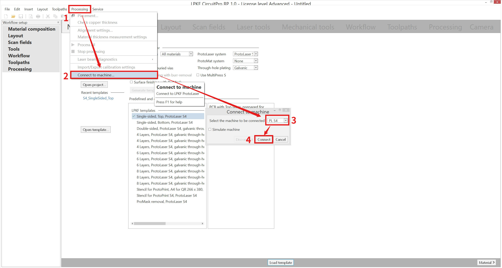

2.选择需要打单面板还是双面板，以单面板顶层为例，双击即可（下面是四层及以上的多层板，需要层压机才能做，目前实验室没有）

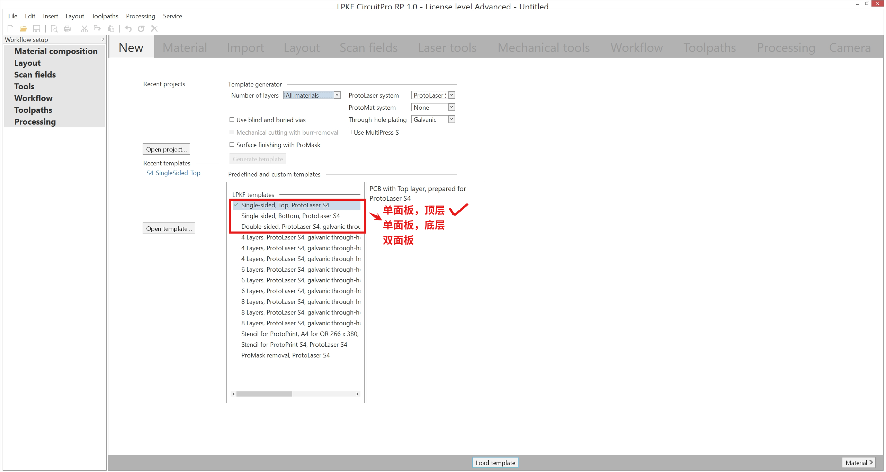

3.选择板子的材料，软件提供两种默认的，分别是0.5oz和1oz，1.5mm芯板FR4材料（1oz（盎司）等于36μm），这个需要根据我们实际使用的板子去自定义材料，在**Material**界面单击选择**FR4**材料，再单击**新建图标**，会新建出一个名字为FR4 2的可自定义材料，点击右边的笔进入编辑界面。

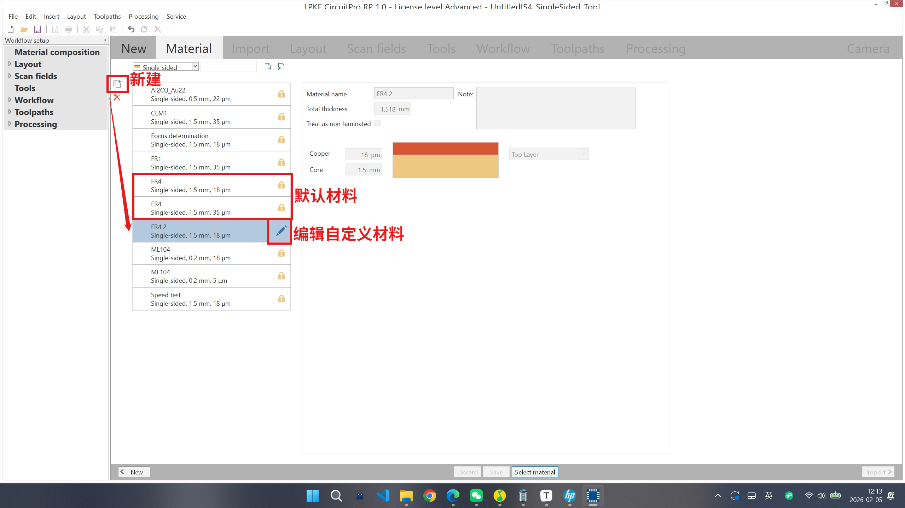

首先给自定义材料命名，接着根据实际购置的板材厚度修改铜厚和芯板厚度，修改完成后点**Material**返回，返回后双击自定义材料即可

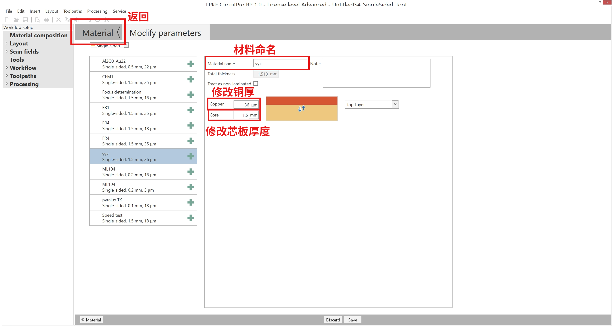

4.导入gerber文件，单面板需要3个文件：顶层、板外框、钻孔层。AD导出的gerber和嘉立创导出的gerber不同，文件选择上也不同。

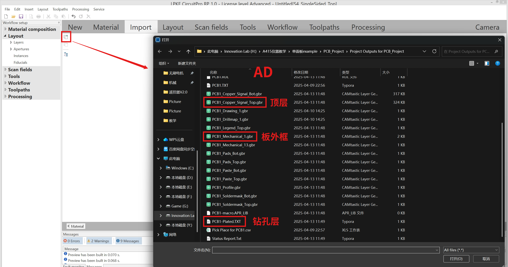

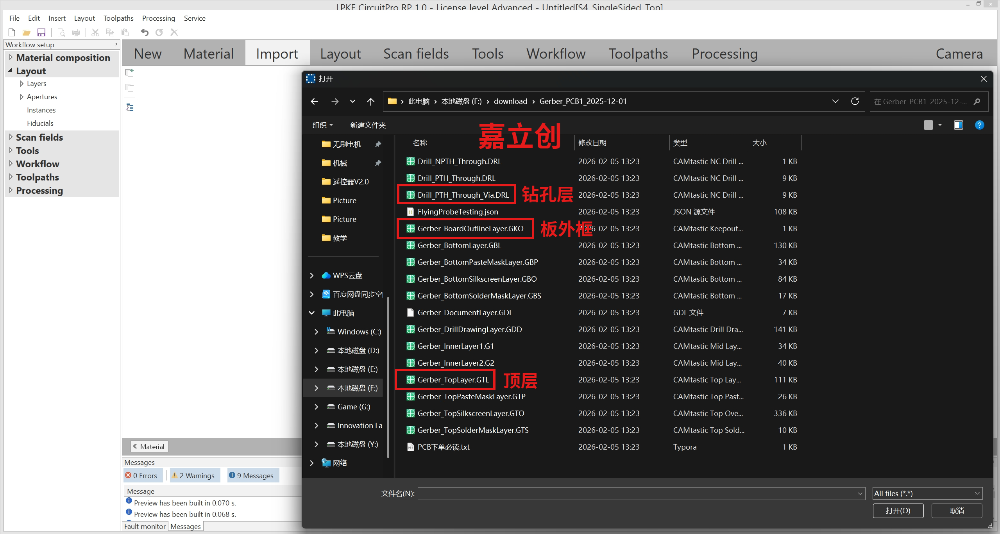

导入文件后将各文件分到各自的层，在Target栏选择即可。

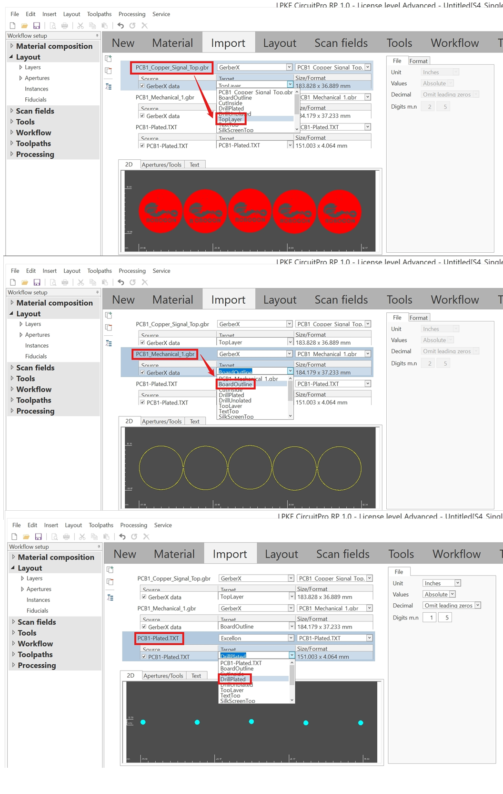

5.导入文件后点击Layout可以看PCB整体，Layout同样可以像EDA软件一样对PCB进行修改。

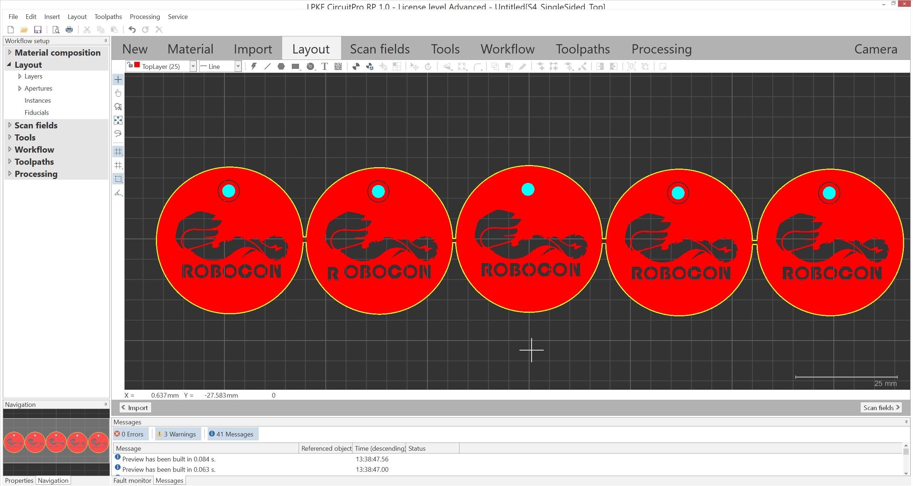

6.设置工作流程，点击Workflow，首先删掉Cut Inside

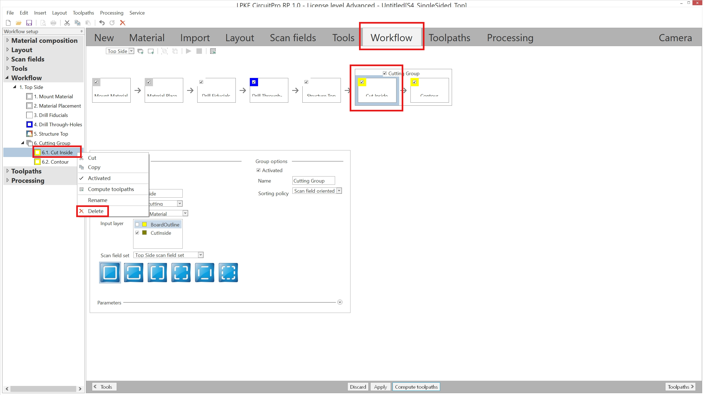

接着修改Contour，软件默认是第四个，我们选择第一个全部切割，这样板子更好取下来

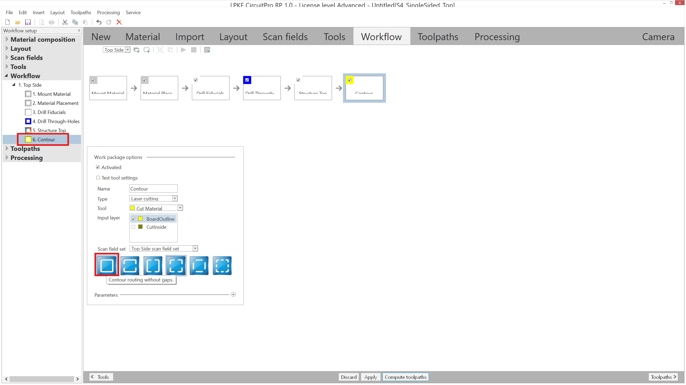

7.计算模拟路径，点击Toolpaths界面，点击Compute toolpaths -> Continue计算路径，计算完成后会出现激光的移动路径。一般这个部分是比较容易报错的，如果模拟不出来路径，检查一下板外框。

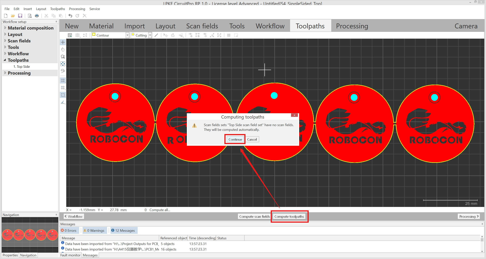

8.对机器进行预热并且准备打板，将防激光辐射机罩打开，先放PVC垫板，接着在PVC垫板上放上FR4板（记得打开空压机），关上防激光辐射机罩，点击**Processing**界面，左上角绿色箭头即为运行，会有弹窗提醒你放板材，放好后点击ok，空压机会开始工作，机器内形成负压，将FR4板固定在三轴平台上，接着点击，可以移动板子在板材上的位置，需要用鼠标点击板子的四个角来观察是否在板材内，如果不在则需要移动到合适位置，调好位置后点击ok即可开始制造，刚开机需要预热20分钟。

每次机器剥铜前都会跳出一个Test tool settings，让你测试激光能否正常剥去铜皮，第一个选项是剥去一个7mmx7mm的铜皮，位置自选；第二个选项是剥去一个35mmx25mm的铜皮，位置自选；右下角的Resume是跳过测试。我们一般点Resume，跳过测试。

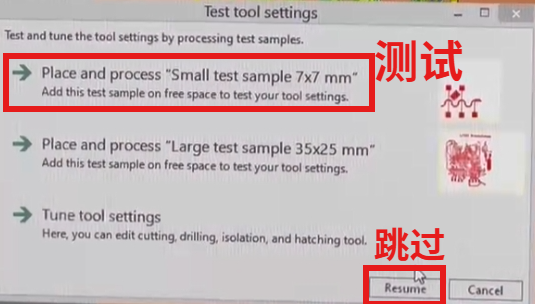

9.打完板后将板子取下，会发现板子的颜色会比较暗沉，并且焦味很大，这是因为激光加工导致板子氧化，需要喷柠檬酸，可以去氧化和除味，柠檬酸用完了可以买可食用的柠檬酸颗粒，不要买工业的柠檬酸颗粒。

### 双面板

## 注意事项

这台机器对环境要求特别是温度严苛，需要在20℃~24℃的条件下工作，不然无法运行。8月打电赛的时候需要把机器下面水冷那个门打开，然后拿风扇给他散热

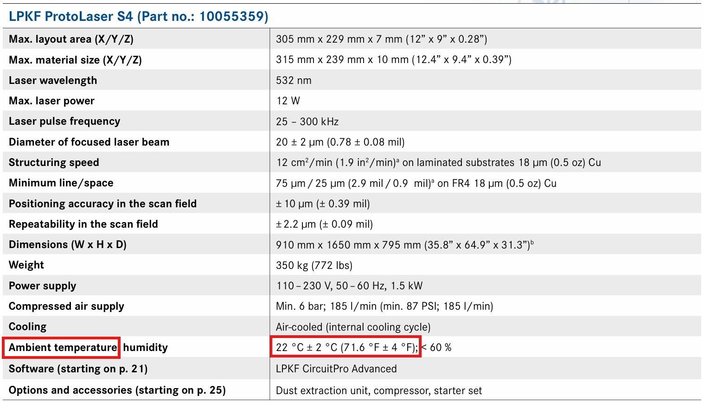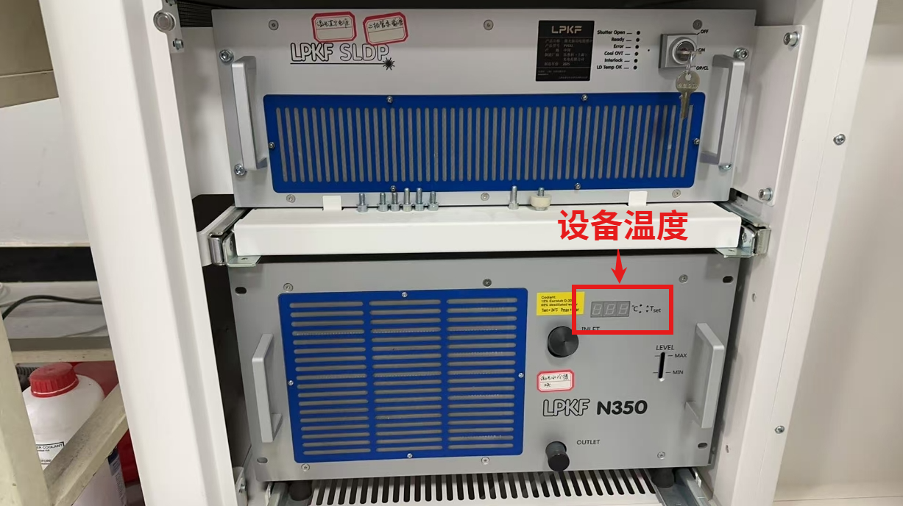

## 设备保护

这台设备原则上会使用的队员都有资格使用，但因某些使用不当情况出现导致雕板机多次故障，所以给设备设置了密码

### 激光水冷模块

这是LPKF ProtoLaser S4的激光水冷模块，右边的LEVEL刻度是冷却液的含量，如果冷却液低于MIN值需要添加冷却液。**冷却液是15%的原液和85%的水**。

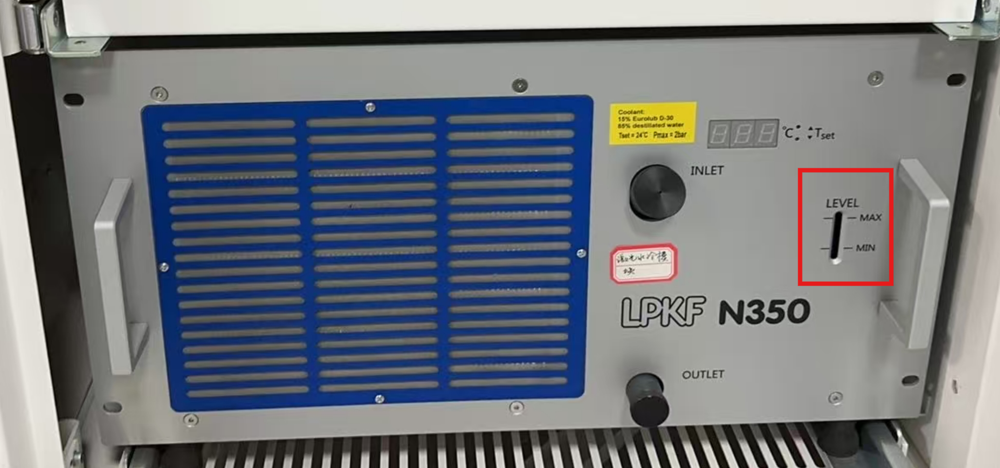

### 空压机

空压机需要维护的地方有两个，一个是更换滤芯一个是排水。滤芯需不需要更换主要看环境干不干净，需要定期检查。因为空气中含水，所以抽气的时候会有水积累在空压机里，拧开底部的排水阀即可排水。

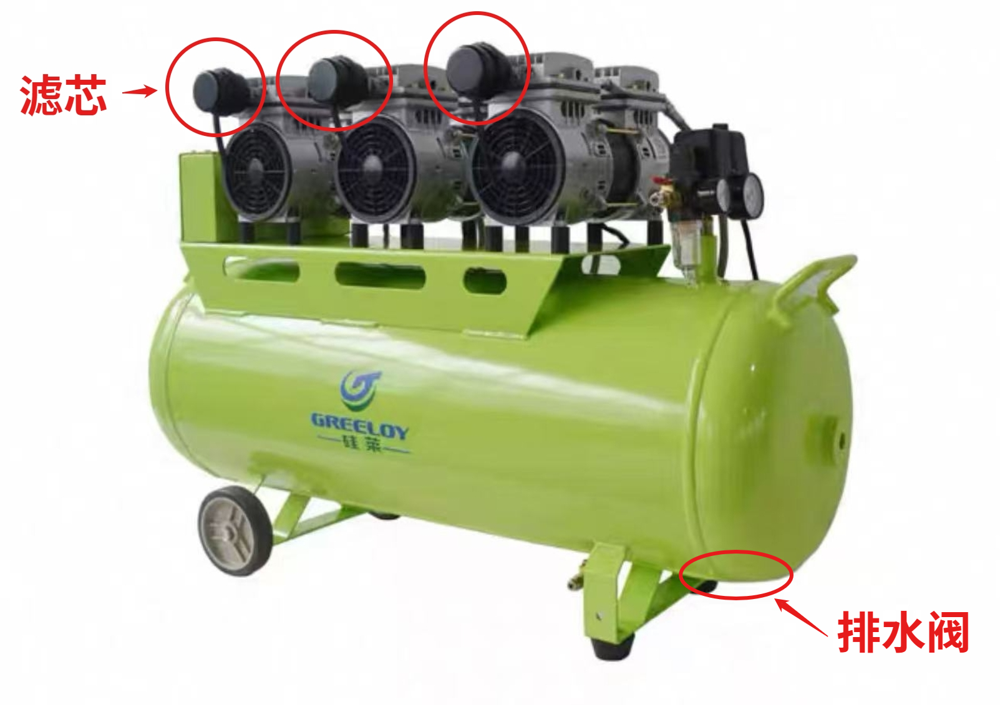

### 吸尘系统

吸尘系统是主机旁边的两个白色的柜体，上柜吸附大颗粒，下柜吸附小颗粒。上柜是可以清理的，一般工作1000h就需要清理上柜，将柜体取出来把剥掉的铜丝倒掉或者用吸尘器清理干净，下柜我们无法清理，如果下柜非常脏了只能更换柜体。

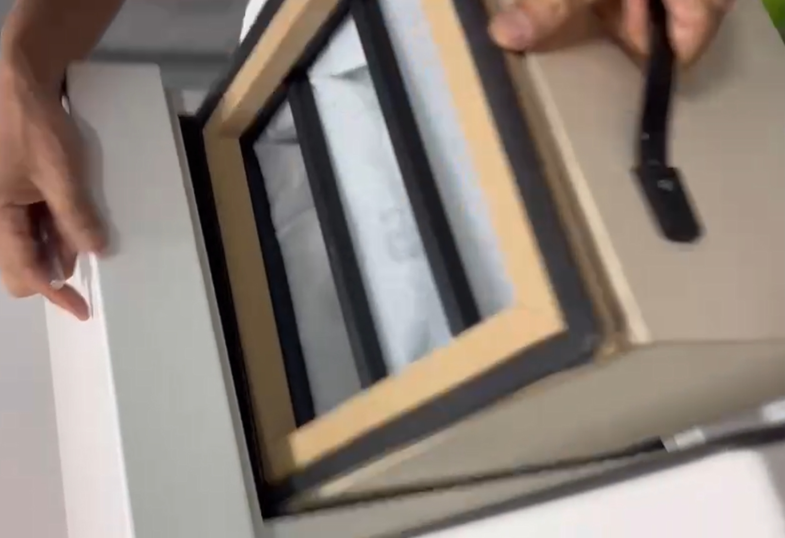

