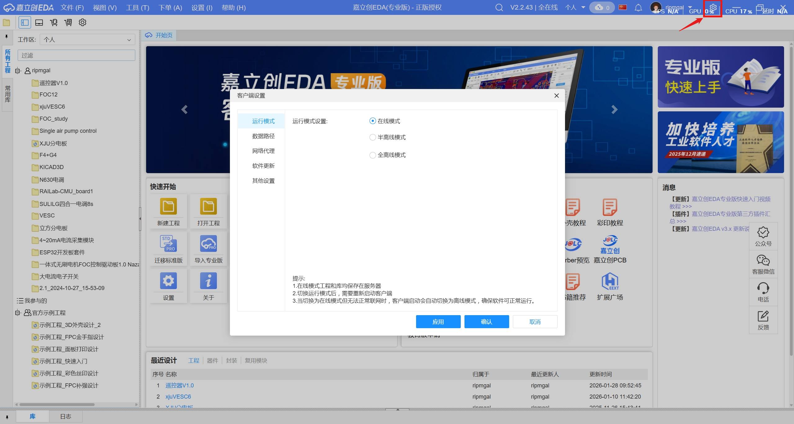
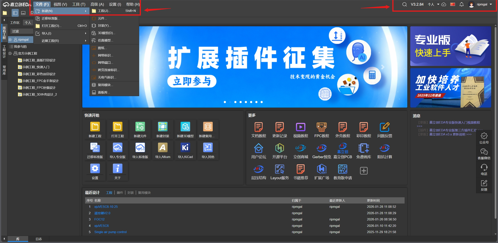
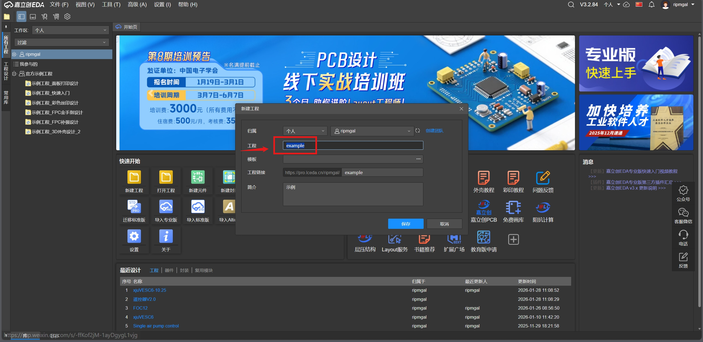
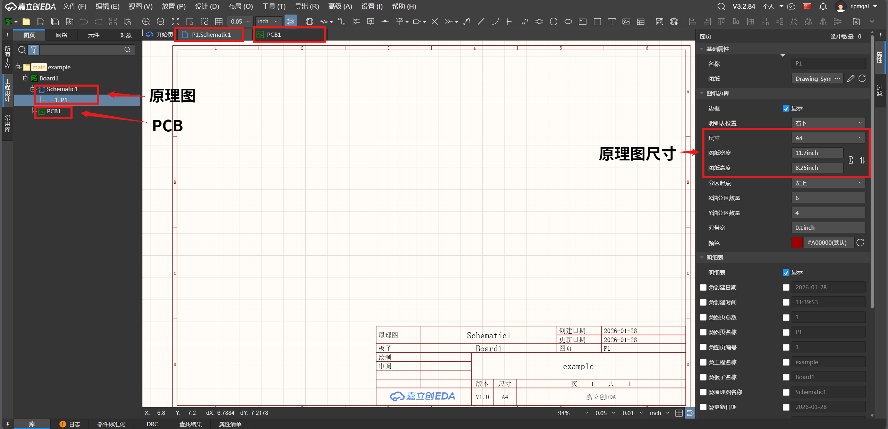
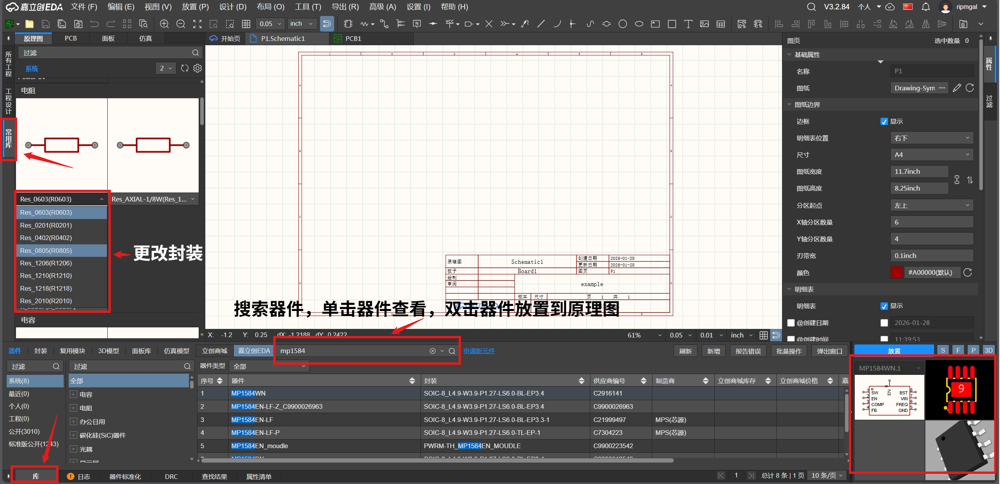
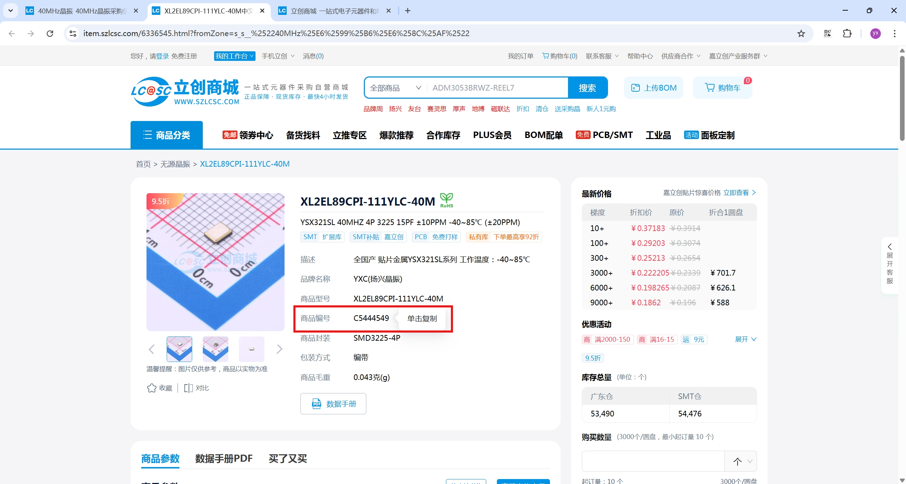
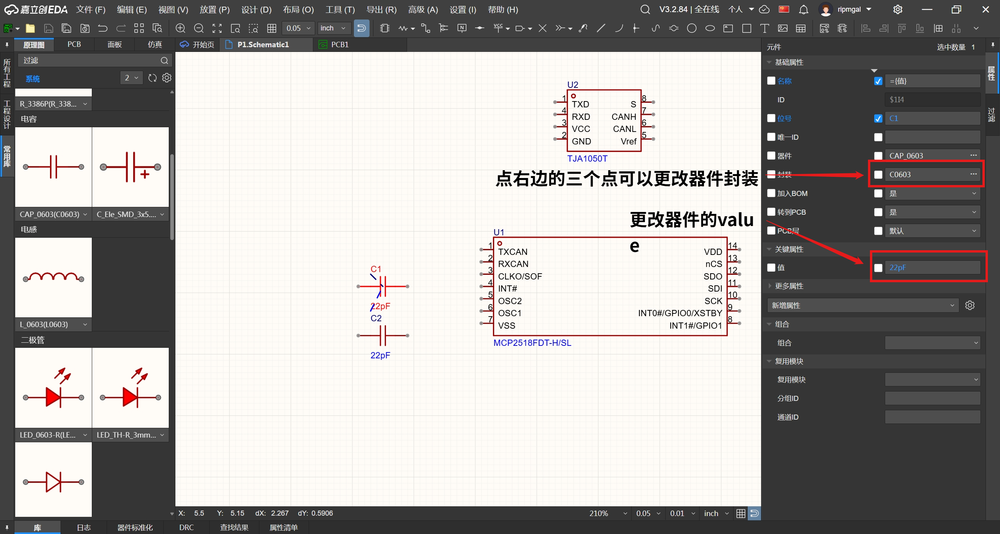
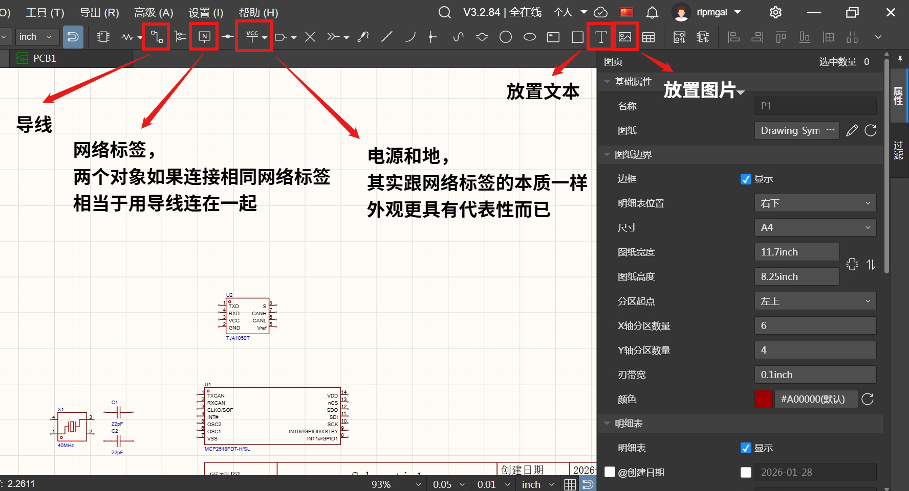

# 零基础入门嘉立创

## 介绍

嘉立创是国内自主可控的电子设计与制造一站式平台，与其他EDA工具（Altium Designer、KiCad）对比：突出“零基础友好”，无需付费、无需复杂配置，元件库自带封装与现货匹配，避免新手因封装绘制、工具安装卡壳，降低学习成本。

## 前期准备

嘉立创EDA既有软件版也有网页版，看个人喜好

客户端下载：[软件下载 - 嘉立创EDA](https://lceda.cn/page/download?src=index)

网页版链接：[嘉立创EDA(专业版) - V3.2.84](https://pro.lceda.cn/editor)

客户端和网页端可能会出现版本不一样的情况，需要注意**低版本无法打开高版本的工程**，2025年10月，嘉立创的客户端大版本是V2，但是网页版大版本已经是V3了，V2无法打开V3的图。下面所有教程都是在V3客户端基础上操作。

------

嘉立创EDA有全在线、半离线、全离线三种模式，网页版默认是全在线模式，客户端可以选择这三种模式，三种模式区别如下：

> 全在线模式：
>
> 1.在线模式工程和库均保存在服务器
> 2.切换运行模式后，需要重新启动客户端
> 3.当切换为在线模式但无法正常联网时，客户端启动会自动切换为离线模式，确保软件可正常运行。

> 半离线模式：
>
> 1.半离线模式工程和库均保存到本地，可以使用在线系统库
> 2.切换运行模式后，需要重新启动客户端

> 全离线模式：
>
> 1.全离线模式工程和库均保存到本地，不支持使用在线系统库
> 2.切换运行模式后，需要重新启动客户端

打开客户端，点击右上角的客户端设置即可更改模式，**不同模式下左边工作区的工程不一样**。

------

熟悉软件的快捷键是熟练画图的基础，可以去嘉立创官网查看[嘉立创所有快捷键](https://prodocs.easyeda.com/cn/introduction/hotkeys/#%E5%8E%9F%E7%90%86%E5%9B%BE-%E7%AC%A6%E5%8F%B7%E5%BF%AB%E6%8D%B7%E9%94%AE)，也可以根据自己习惯在设置里修改快捷键，下面列出常用的快捷键方便查看。

|                       原理图指令                       | 嘉立创专业版默认快捷键 |
| :----------------------------------------------------: | :--------------------: |
|                          旋转                          |         Space          |
| 放置元素（引脚、网络标签、电源地端口）时显示属性对话框 |          Tab           |
|                        绘制导线                        |         Alt+W          |
|                      放置网络标签                      |         Alt+N          |

|           PCB指令           | 嘉立创专业版默认快捷键 |
| :-------------------------: | :--------------------: |
|            旋转             |         Space          |
|          单路布线           |         Alt+W          |
| 布线/放置过孔时切换常用过孔 |        Shift+V         |
|          切换单位           |           Q            |
|          左右翻转           |           X            |
|          上下翻转           |           Y            |
|      高亮/取消全部高亮      |        Shift+H         |

## 原理图

1.首先打开网页版，右上角登录或者注册，登录完后点击左边：**文件 - 新建 - 工程**

2.给工程命名

3.左侧工程设计栏会默认生成一个原理图和一个PCB文件，双击打开，右侧属性可以改原理图尺寸

4.放置元器件，常见的元器件如电容、电阻、排针、排母、LED等可以在左侧的**常用库**选择，点击器件下面的箭头可以选封装。常用库没有的期间可以在左下角的**库**找，点击库会出现弹窗，输入需要的器件名搜索即可，点击器件，右下角会出现该器件的原理图、封装、3D封装，双击器件可以把器件放置到原理图，**鼠标左键确定放置，右键取消放置**。

如果有器件在库里也搜不到，可以去[立创商城](https://www.szlcsc.com/)搜，找到需要的器件复制商品编号，粘贴到库里的搜索框，也可以找到。

5.修改元器件的属性，单击元器件选中，右侧是元器件的属性，比较重要的是**封装**和**值**，点封装右边的三个点可以更换封装，修改元器件的值主要是方便焊接和smt选型，嘉立创EDA有一个很有用的功能叫焊接辅助工具，在绘制PCB时介绍。

6.放置好器件后，就可以进行电气连接，先介绍连线常用的指令：导线、网络标签、电源和地。

## PCB

## PCB下单

## 没有idea怎么办

[立创开源硬件平台](https://oshwhub.com/)

## 结语

本文旨在帮队内降低电路开发门槛
