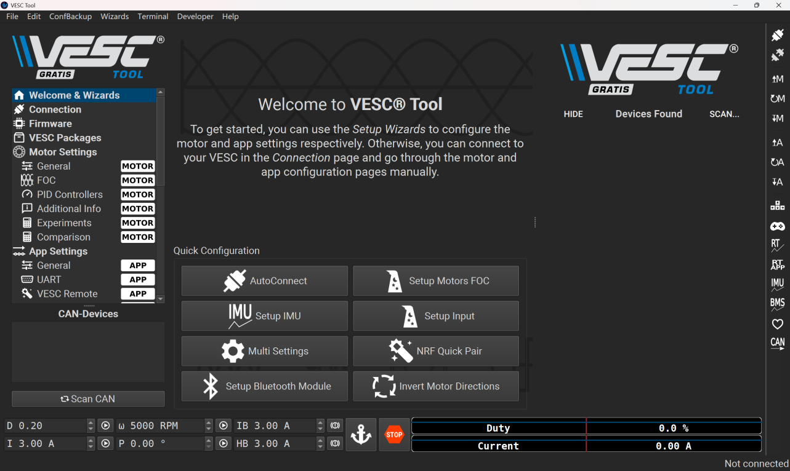
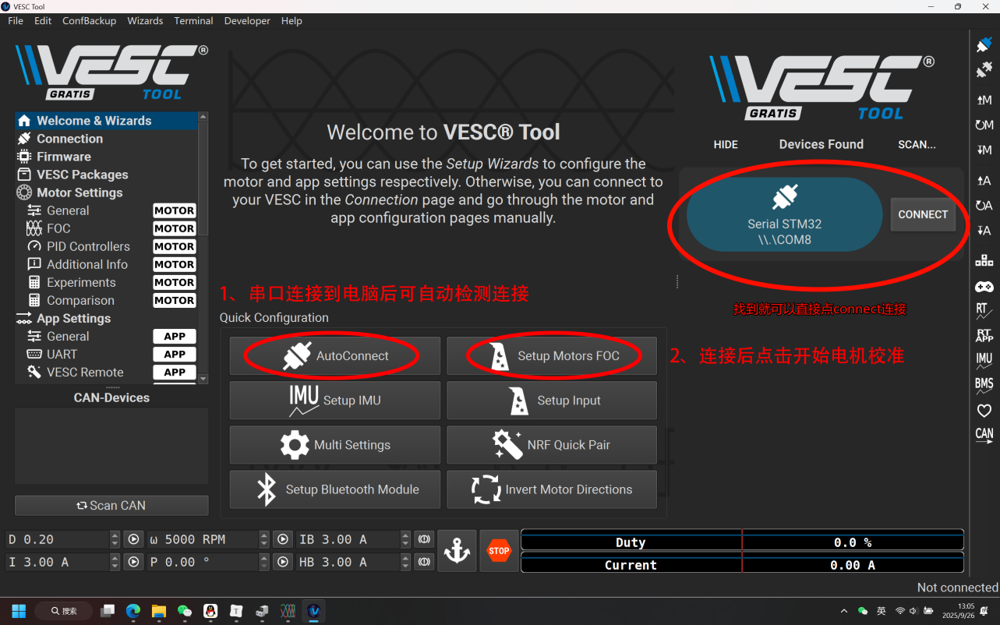
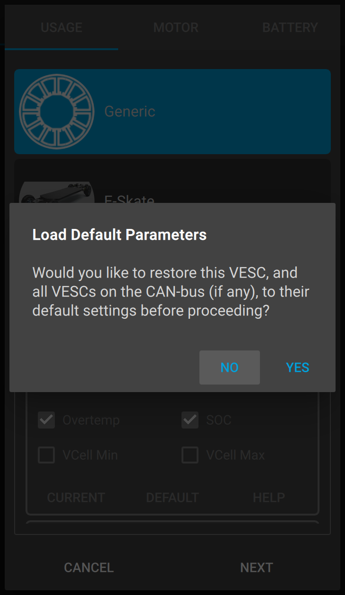
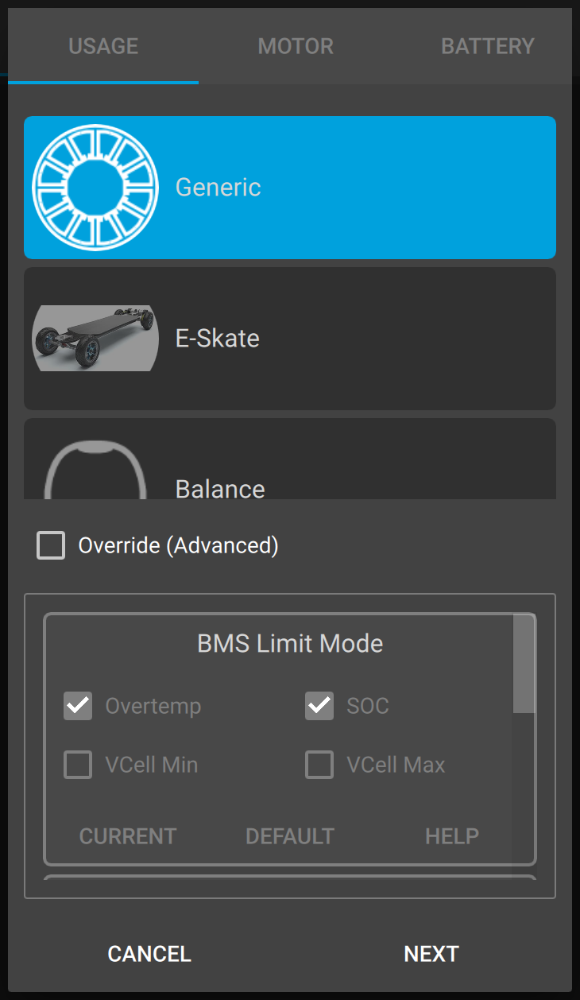
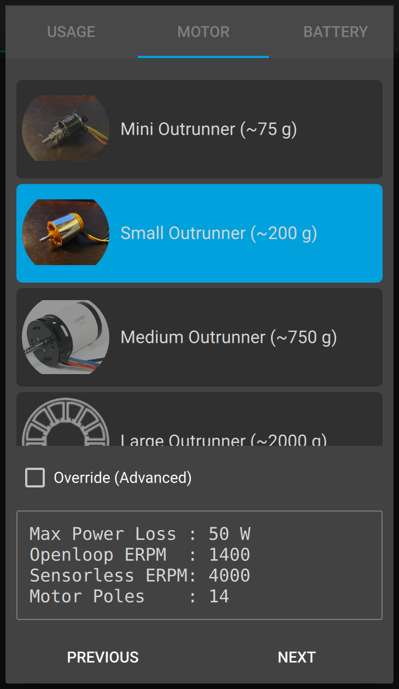
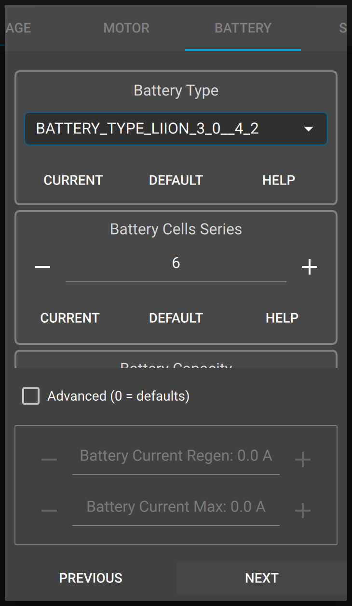
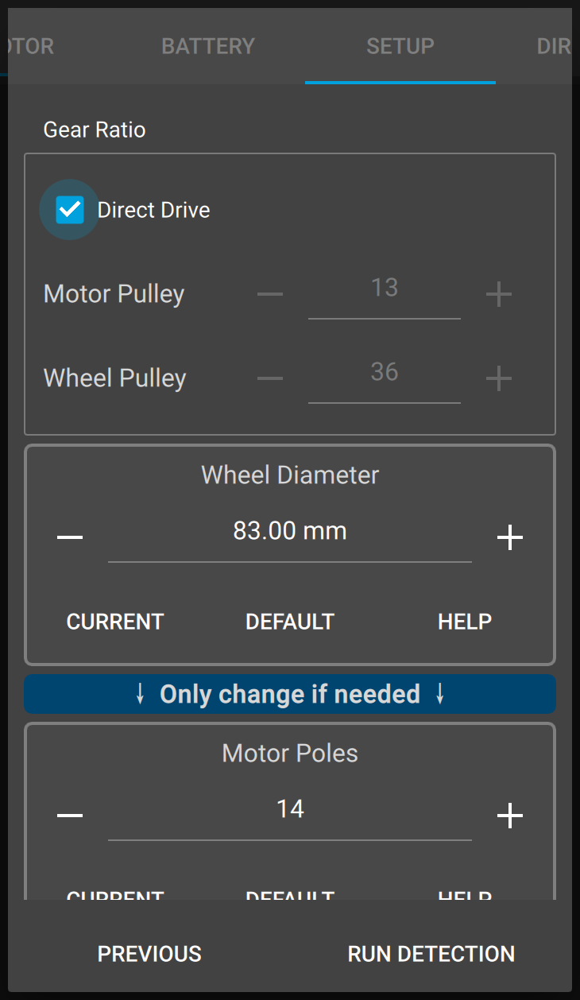
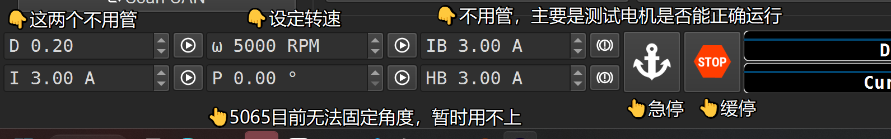

# VESC电机

## 一、上位机使用

战队仓库中提供两个版本的 `VESC` 软件，以下示例为6.03版本。

### 1. 进入主界面



### 2. 连接串口



连接成功后，右下角会有如下提示：


### 3. 电机校准

点 `Setup Motors FOC` ，进⼊电机校准环节，电机先会嗡嗡响，然后再慢慢转。



因为我们使⽤的电机⼤约在`200g`左右，选择第⼆个 `Small Outrunner`

**注：如果有其他`VESC`电机但不确定具体重量就选择偏小的，否则有可能烧坏电机。**







`Gear Ratio`为减速⽐，5065为直驱电机，选择`Direct Drive`，就可以跑 `RUN DETECTION`了



至此电机校准完成！

### 4. 电机旋转测试

电机转速要设定为1000转，可以设定为负，但是两次设定差值不要超过2000，否则电机可能因加速太快对使用者造成伤害。



## 二、驱动代码解析

### 1. 数据结构定义

```c
/**
 * @brief VESC 电机参数
 */
typedef struct {
    uint8_t vesc_id;         /*!< 电机 ID */
    can_selected_t can_select; /*!< 选择 CAN1 还是 CAN2 */

    float input_voltage; /*!< 电机电压 */
    float duty;          /*!< MOSFET 占空比 */
    float erpm;          /*!< 转速 */

    float amp_hours;         /*!< 电流时间 */
    float amp_hours_charged; /*!< 电流充电时间 */

    float watt_hours;         /*!< 功率时间 */
    float watt_hours_charged; /*!< 功率充电时间 */

    float motor_current; /*!< 电机电流 */
    float total_current; /*!< 总电流 */

    float mosfet_temperature; /*!< MOSFET 温度 */
    float motor_temperature;  /*!< 电机温度 */

    float pid_pos; /*!< 转子位置 */

    int32_t tachometer_value;     /*!< 转速表 */
    vesc_fault_code_t error_code; /*!< 错误码 */
} vesc_motor_handle_t;
```

该结构体包含了 `VESC` 电机的所有参数。

### 2. 函数用法说明

```c
/* 中断回调：CAN 接收中断触发，解析状态帧并更新电机参数 */
vesc_can_callback

/* 驱动初始化：配置电机 ID 和 CAN 接口，注册接收回调到 CAN 列表 */
vesc_motor_init

/* 反初始化 */
vesc_motor_deinit

/* 设置占空比 */
vesc_motor_set_duty

/* 设置电流 */
vesc_motor_set_current

/* 设置转速 */
vesc_motor_set_erpm

/* 设置位置 */
vesc_motor_set_pos
```

### 3. 核心设计思想

（1）协议层与业务层解耦

​	`VESC` 的 CAN 协议比较复杂（使用 29 位扩展帧，ID 包含指令和地址，数据段涉及大端序和比例缩放），驱动层使用 `buffer_append` 库处理数据的大端/小端转换，上层逻辑只需关心物理数值，无需关心通信协议的比例因子。

（2）读写分离

代码对数据的流向处理采用了读写分离的策略：

- **写（控制）是主动的**:
  - 调用 `vesc_motor_set_erpm` 等函数时，立即组包并通过 CAN 发送。这保证了控制指令的实时性。
- **读（反馈）是被动的**:
  - `VESC` 电调会按照配置的频率主动定时发送状态帧。
  - 驱动层被动接收并更新结构体缓存。这种设计减少了总线上的查询请求负载，适合高频实时控制。

## 三、驱动代码使用

1. 将头文件复制到`User/Bsp/Inc/`中，源文件复制到`User/Bsp/Src`中
2. 将`vesc_motor.c`添加到工程的`Bsp`分组中
3. 在`bsp.h`中包含`vesc_motor.h`

```c
/* demo */

void vesc_demo(void) {
    vesc_motor_handle_t vesc_demo;
    vesc_motor_init(&vesc_demo, 1, can1_selected);

    /* 设置转速 */
    vesc_motor_set_erpm(&vesc_demo, 1000.0f);
    /* 设置角度 */
    vesc_motor_set_pos(&vesc_demo, 30.0f);
    /* 设置占空比 */
    vesc_motor_set_duty(&vesc_demo, 0.2f);
}
```

