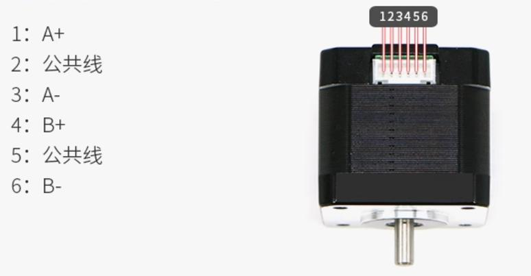

# 步进电机

## 一、接线

步进电机与驱动板AB相的接线如图所示：



**注：实验室内的步进电机一般都是只引出1/3/4/5四个接口，只需按顺序接到驱动板即可。**

驱动板与开发板采用共阴极接法：

驱动板上的脉冲- ，方向- ，脱机- 接到开发板的`GND`；脉冲+， 方向+ ，脱机+ 接到相对应的IO口。

---

## 二、驱动程序解析

本驱动模块通过 **PWM + 中断计数** 的方式实现步进电机的非阻塞控制。

### 1. 数据结构定义

```C
/**
 * @brief 步进电机句柄
 */
typedef struct {
    step_motor_state_t state;   /*!< 当前状态 */
    step_motor_gpio_t en_pin;   /*!< EN 引脚 */
    step_motor_gpio_t dir_pin;  /*!< DIR 引脚 */
    step_motor_gpio_t step_pin; /*!< STEP 引脚 */

    TIM_HandleTypeDef *htim; /*!< 定时器句柄 */
    uint32_t channel;        /*!< 定时器通道 */
    uint32_t pulse_remain;   /*!< 剩余的脉冲数 */

    step_motor_dir_t dir; /*!< 电机当前方向 */
} step_motor_handle_t;

/* 电机转一圈需要的脉冲数 (步距角1.8° 通常为200，若有细分需乘细分倍数) */
#define STEP_MOTOR_CIRCLE_PULSE 200 

/* 初始 PWM 周期 (单位: us)，值越大频率越低，速度越慢 */
#define STEP_MOTOR_INIT_PERIOD  1000
```

驱动的核心在于 `step_motor_handle_t` 结构体，它封装了电机的控制参数。通过该结构体，开发者可以统一管理多个不同配置的步进电机。

### 2. 函数用法说明

```c
/* 驱动逻辑初始化：初始化 PWM，设置默认电平，配置句柄状态 */
step_motor_init

/* 反初始化 */
step_motor_deinit

/* 使能电机 */
step_motor_enable

/* 失能电机 */
step_motor_disable

/* 设置方向 */
step_motor_set_dir

/* 设置速度：修改 PWM 周期  */
step_mtoor_set_speed

/* 相对运动控制：传入有符号整数，正数正转，负数反转，绝对值代表脉冲数 */
step_motor_run

/* 中断回调：PWM 脉冲结束时调用，处理脉冲计数*/
step_motor_interrupt_callback
```

### 3. 核心设计思想

（1）**`PWM` 生成脉冲**:
- 利用 `STM32` 的通用定时器的 `PWM` 输出功能产生方波，直接驱动步进电机的 `STEP` 引脚。
- **速度控制**: 通过修改定时器的自动重装载寄存器 (`ARR`) 和比较寄存器 (`CCR`) 来改变 `PWM` 的频率，从而调整电机转速。

（2）**中断控制步数**:
- 开启定时器的 **`PWM` 脉冲更新中断**。
- 每发送一个 `PWM` 脉冲，触发一次中断。在中断回调函数中递减 `pulse_remain` ( 剩余脉冲数 )。
- 当 `pulse_remain` 减为 0 时，关闭定时器，电机停止。

（3）**非阻塞特性**:
- 调用 `step_motor_run` 后，定时器在后台自动运行，CPU 可以处理其他任务，仅在中断触发时消耗极少量的 CPU 资源。

## 三、驱动程序使用

1. 将相应文件夹复制到  `/Drivers/bsp/`  下

2. 在`BSP`层加入 `step_motor.c`和`step_motor.h` 后

3. 在`bsp.h`中包含

   ```c
   #include "./step_motor/step_motor.h"
   ```

4. 自行配置脉冲/方向/脱机所对应的IO口，并配置相应的定时器中断。

5. 使用 `step_motor_init` 进行基本的初始化。

6. 使用 `step_mtoor_set_speed` 设定电机运行速度。

7. 使用 `step_motor_run` 设定所发的脉冲数。

```c
/* demo 如下 */

step_motor_handle_t g_step_motor_handle;	/* 步进电机句柄 */
TIM_HandleTypeDef g_htim5_handle;           /* 定时器句柄 */

/* 配置IO口，定时器等 */
void step_motor_basic_init(void)
{
    g_step_motor_handle.en_pin.port = GPIOA;
    g_step_motor_handle.en_pin.pin = GPIO_PIN_5;
    g_step_motor_handle.dir_pin.port = GPIOA;
    g_step_motor_handle.dir_pin.pin = GPIO_PIN_6;
    g_step_motor_handle.step_pin.port = GPIOA;
    g_step_motor_handle.step_pin.pin = GPIO_PIN_1;
    g_step_motor_handle.htim = &g_htim5_handle;
    g_step_motor_handle.channel = TIM_CHANNEL_2;
    g_htim5_handle.Instance = TIM5;
    __HAL_RCC_TIM5_CLK_ENABLE();
    __HAL_RCC_GPIOA_CLK_ENABLE();
    HAL_NVIC_SetPriority(TIM5_IRQn, 2, 0); 
    HAL_NVIC_EnableIRQ(TIM5_IRQn);
}

void TIM5_IRQHandler(void)
{
    HAL_TIM_IRQHandler(&g_htim5_handle);
}

/**
 * @brief  HAL库TIM回调函数重写
 *         当PWM中断发生时，HAL库会调用此函数
 */
void HAL_TIM_PWM_PulseFinishedCallback(TIM_HandleTypeDef *htim)
{
    if (htim == &g_htim5_handle)
    {
        step_motor_interrupt_callback(&g_step_motor_handle);
    }
}

/* 按下一次WKUP按键，发200个脉冲 */
void demo(void) 
{
    step_motor_basic_init();
    step_motor_init(&g_step_motor_handle);
    key_press_t key = KEY_NO_PRESS;
    uint32_t pulse_num = 0;
    step_mtoor_set_speed(&g_step_motor_handle, 2000);
    while(1)
    {
        key=key_scan(0);
        switch (key)
        {
        case KEY0_PRESS:
            pulse_num = 200;
            break;
        case KEY1_PRESS:
            pulse_num = -200;
            break;
        case WKUP_PRESS:
            step_motor_run(&g_step_motor_handle, pulse_num);
            break;
        default:
            break;
        }
        HAL_Delay(5);
    }
}
```

---

## 四、注意事项

1. 上电后先观察驱动板指示灯，若亮红灯，立马断电！
2. 若步进电机不转，但发出持续响声，马上断电，看看AB相是否接线错误！
3. 若步进电机转动，但转的角度不对，可以看看驱动板上的拨码开关设置的细分和脉冲数是否与程序中设置的所对应。