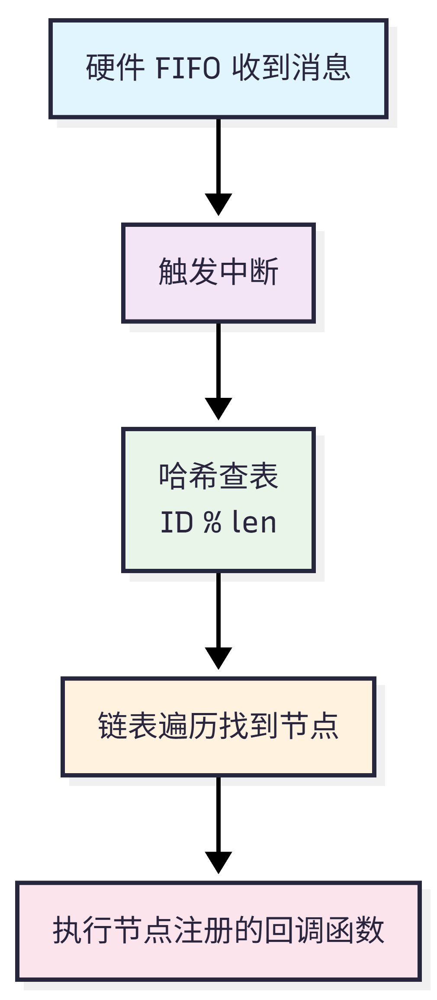

> 更新日期：2026/2/2
>
> 参与者：Jackrainman，PickingChip
>
> 源码地址：[can_list](https://github.com/XJU-Hurricane-Team/STM32-Driver/tree/main/Motor/can_list)

### 解决什么问题

在机器人电控系统中，一个 CAN 总线挂载多个电机和传感器。对于不同的电机回传的消息格式不同，同时也有着不同的处理方式，传统开方式在中断中使用 `switch-case` 处理不同 CAN ID：

```c
void HAL_CAN_RxFifo0MsgPendingCallback(CAN_HandleTypeDef *hcan) {
    if (header.ExtId == 0x201) { /* 处理左前轮 */ }
    else if (header.ExtId == 0x202) { /* 处理右前轮 */ }
    // ... 更多 else if
}
```

这种方式在机构复杂之后有着明显的痛点：

- 中断占用时间长
- 代码维护困难
- 业务逻辑与硬件中断耦合

因此本模块使用哈希表 + 链表的方式组织起总线上的所有节点，通过在节点中注册的回调函数处理不同电机的处理需求，从而实现消息接收与电机处理的解耦。


### 快速使用

1. 将该文件夹复制到 `/Drivers/bsp/` 下。
2. 在`bsp.h`中使用相对路径包含：`#include "can_list/can_list.h"`。
3. 初始化 CAN 外设。
4. 使用`can_list_add_can`添加一个 CAN 外设。
5. 使用`can_list_add_new_node`添加 CAN 外设对应的设备。


### 数据结构

#### `can_table`

CAN 表指针数组，数组长度为主控 CAN 外设的个数，每一个 CAN 外设有单独的 CAN 表。

```c
can_table_t *can_table[CAN_LIST_MAX_CAN_NUMBER];
```

#### `can_table_t`

CAN 表类型，每一个包含两个哈希表分别用于标准帧和拓展帧节点的查询。

```c
typedef struct {
  hash_table_t id_table[2]; /*!< 标准帧和拓展帧哈希表.  */
} can_table_t;
```

#### `hash_table_t`

哈希表类型，包含表长和一个指向`can_node_t`类型的二级指针（可视为CAN 节点指针数组），该数组每一位都挂载由哈希值相等的 CAN 节点组成的链表。

```c
typedef struct {
    can_node_t **table; /*!< CAN 节点指针数组 */
    uint32_t len;       /*!< 表的长度        */
} hash_table_t;
```

#### `can_node_t`

CAN 节点类型，总线上所有电机在初始化的时候都通过`can_list_add_new_node`分配一个该类型的 CAN 节点，这个节点有以下成员。当 CAN 外设接收到电机消息后，根据消息的ID查表找到电机对应的节点，从而触发回调函数执行数据处理。

```c
typedef struct can_node {
    void *can_data;          // 设备对象指针（如 Motor_t*）
    uint32_t id;             // 期望的 CAN ID
    uint32_t id_mask;        // ID 掩码
    can_callback_t callback; // 回调函数
    struct can_node *next;   // 链表后继
} can_node_t;
```

#### `queue_msg_t`

消息队列数据类型，在启用 RTOS 时触发中断后会在中断中发送

```c
typedef struct {
#if CAN_LIST_USE_FDCAN
  FDCAN_HandleTypeDef *hcan; /*!< The handle of FDCAN.   */
#else              /* CAN_LIST_USE_FDCAN */
  CAN_HandleTypeDef *hcan; /*!< The handle of CAN.     */
#endif             /* CAN_LIST_USE_FDCAN */
  uint32_t rx_fifo;      /*!< The FIFO which received. */
} queue_msg_t;
```


###  工作流程

大致工作流程如下：

{.img-scale-25}

对于整个流程的实现，是否启用 RTOS 有些区别。当启用  RTOS 之后调用`can_list_add_can`函数会创建`can_list_polling_task`任务，该任务会一直阻塞式轮询消息队列。

```c
    while (1) {
        xQueueReceive(can_list_queue_handle, &recv_msg, portMAX_DELAY);//源文件372行
        ...
        }
```

直到 CAN 外设接到消息触发中断，中断服务函数中向队列消息写入消息，此时该任务才会根据消息队列中消息的去读取 CAN 接收队列中的电机消息，再去执行查表，进而执行对应电机的回调函数。这样设计的目的是为了让中断执行的时间尽可能短，如果为启用 RTOS 上述操作将在中断服务函数中调用`can_message_process`执行。

```c
void HAL_FDCAN_RxFifo0Callback(FDCAN_HandleTypeDef *hfdcan,
                               uint32_t RxFifo0ITs) {
    if ((RxFifo0ITs & FDCAN_IT_RX_FIFO0_NEW_MESSAGE) == RESET) {
        return;
    }

#if CAN_LIST_USE_RTOS
    if (can_list_queue_handle == NULL) {
        return;
    }

    send_msg_from_isr.hcan = hfdcan;
    send_msg_from_isr.rx_fifo = FDCAN_RX_FIFO0;
    xQueueSendFromISR(can_list_queue_handle, &send_msg_from_isr, NULL);
#else  /* CAN_LIST_USE_RTOS */
    can_message_process(hfdcan, FDCAN_RX_FIFO0);
#endif /* CAN_LIST_USE_RTOS */
}
```


### 配置宏

该模块支持的许多功能通过下述宏来进行配置。

| 宏定义                    | 默认值   | 说明                                                         |
| ------------------------- | -------- | ------------------------------------------------------------ |
| `CAN_LIST_USE_FDCAN`      | 0        | 1=启用 FDCAN，0=启用 bxCAN。STM32 HAL 库的 bxCAN 与 FDCAN 互不兼容，但本模块代码兼容两者 |
| `CAN_LIST_MAX_CAN_NUMBER` | -        | 最大支持的 CAN 外设数量，根据MCU的CAN控制器数量确认          |
| `CAN_LIST_USE_RTOS`       | 1        | 1=使用 FreeRTOS 任务处理 CAN 消息，加快中断退出时间；0=中断内直接处理。<br />**启用后需要注意 CAN 中断的优先级不能高于 FreeRTOS 可管理的优先级！ <br />启用后使用`can_list_add_can`时，一定要在`vTaskStartScheduler()`后使用！** |
| `CAN_LIST_QUEUE_LENGTH`   | 5        | FreeRTOS 消息队列长度                                        |
| `CAN_LIST_TASK_PRIORITY`  | 2        | FreeRTOS 任务优先级                                          |
| `CAN_LIST_MALLOC`         | `malloc` | 内存分配函数                                                 |
| `CAN_LIST_FREE`           | `free`   | 内存释放函数                                                 |


###  API

| 函数 | 说明 |
|------|------|
| `can_list_add_can(can, std_len, ext_len)` | 初始化 CAN 实例 |
| `can_list_add_new_node(...)` | 注册设备节点 |
| `can_list_del_node_by_id(...)` | 删除节点 |
| `can_list_change_callback(...)` | 更改回调 |

#### `can_list_add_can`

添加一个 CAN 实例，初始化其哈希表。

```c
uint8_t can_list_add_can(can_selected_t can_select, uint32_t std_len, uint32_t ext_len);
```

| 参数         | 说明                                                    |
| ------------ | ------------------------------------------------------- |
| `can_select` | CAN 外设选择（如 `can1_selected`）                      |
| `std_len`    | 标准帧哈希表桶数，根据 ID 分布设置（设为 1 退化为链表） |
| `ext_len`    | 扩展帧哈希表桶数，根据 ID 分布设置（设为 1 退化为链表） |

#### `can_list_add_new_node`

注册设备节点，绑定 ID、掩码、设备指针和回调函数。

```c
uint8_t can_list_add_new_node(
    can_selected_t can_select,
    void *node_ptr,           // 设备指针，收到数据后传入回调
    uint32_t id,              // 设备反馈 CAN ID
    uint32_t id_mask,         // ID 掩码
    uint32_t id_type,         // CAN_ID_STD 或 CAN_ID_EXT
    can_callback_t callback   // 回调函数（不能为空！）
);
```

#### `can_list_del_node_by_id`

通过 ID 删除已注册的设备节点。

```c
uint8_t can_list_del_node_by_id(can_selected_t can_select, uint32_t id_type, uint32_t id);
```

#### `can_list_change_callback`

通过 ID 动态更改回调函数。

```c
uint8_t can_list_change_callback(can_selected_t can_select, uint32_t id_type, uint32_t id, can_callback_t new_callback);
```

#### `can_callback_t`

回调函数指针类型，电机的回调函数必须满足该格式。

```c
typedef void (*can_callback_t)(void *node_obj, can_rx_header_t *header, uint8_t *data);
```

| 参数 | 说明 |
|------|------|
| `node_obj` | 注册时传入的设备指针 |
| `header` | CAN 消息头（包含 ID、ID 类型、数据长度等） |
| `data` | CAN 数据负载（8 字节） |
