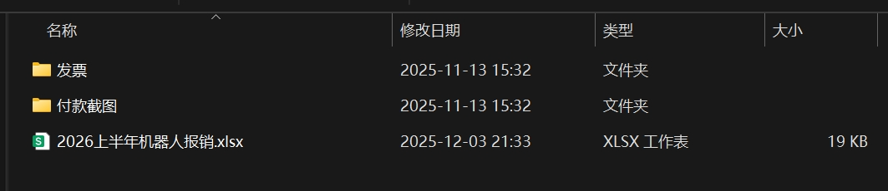
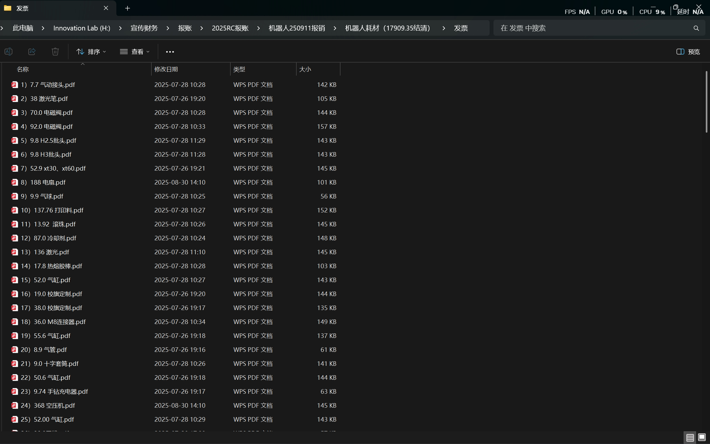
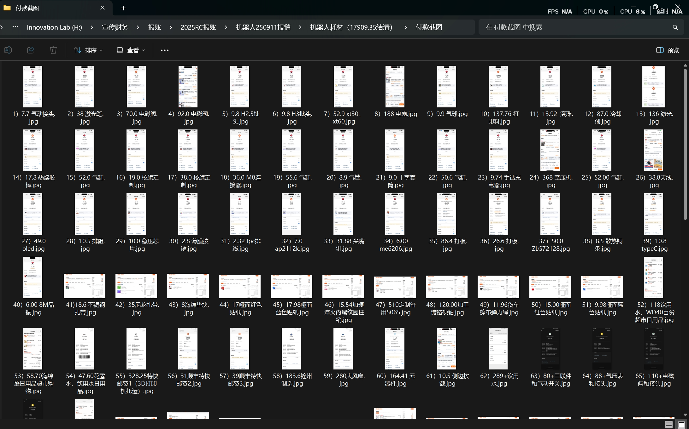
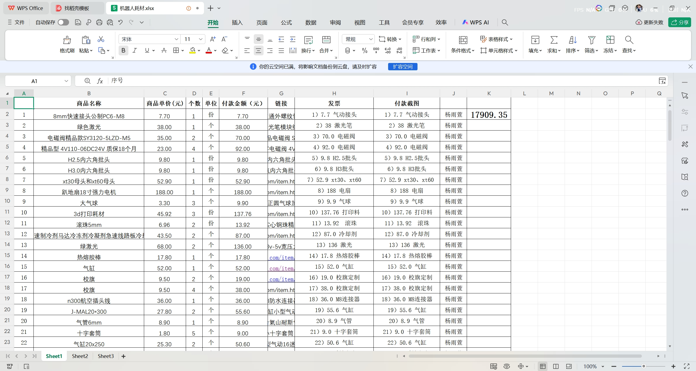

# 关于战队的财务

## 财务制度

财务是战队不可或缺的位置，主要工作是将战队的花销跟老师对接，老师给予经费给财务进行物资采购。HURRICANE战队的财务工作主要由财务负责，队长辅助管理。财务经理必须选用了解战队采购需求、细心负责的队员担任。

战队的主要资金来源是学校和学院，所以财务工作必须绝对真实，需在赛季结束前保存好该赛季的采购报销材料。**战队资金的主要去向分为耗材、路费、住宿费、托运费、场地租赁费。**耗材即制造机器人购买的物资，路费即去华凌或者火车站打车车费和去赛场的火车票，住宿费即备馆宿舍的住宿费水电费和南理工的住宿费，托运费即机器人和比赛工具等来回江阴和乌鲁木齐的费用，场地租赁费即江阴备馆的场地租赁费用。以2025赛季为例，该赛季耗材费52191.84元、打出租和货拉拉6734.77元、火车票14774元、住宿费（24人）5643元、机器人来回运费6864.1元、场地租赁费（机器人加马术）8657.14元。

在2025赛季和2026赛季，HURRICANE的财务制度是：**上半年战队的正式队员都可购买物资，下半年一律由财务进行购买，为正式队员减轻工作**，流程如下：

上半年队员根据比赛需求购买物资并且留存好发票和付款截图，寒假财务收集汇总上半年采购的物资并且给队员进行报销。

下半年统一由财务购买物资，队员将需要购买的物资填入飞书收集表，财务负责购买、整理发票、整理付款截图、与老师对接等工作。

## 报销材料

财务给老师提交的材料应包含以下三个文件：**发票、付款截图、采购物资Excel表**。发票和付款截图的金额必须相同才能报销，如果不一样无法报销。

### 发票

每张发票只能报销一次，**命名方式为：序号）金额  物品**，例如  1）50 KFC  。发票要开普通发票，且必须是pdf形式，结尾附开票资料。

### 付款截图

付款截图命名方式应与对应发票一样，可以是淘宝或者支付宝付款截图，**需要注意的是金额也应与发票金额一样**，有的淘宝账号会有优惠券，或者是4元左右的集运运费，导致付款金额和开出来的发票金额不一样，这种情况无法报销，所以最好买之前提前问好商家运费会不会开在发票里，尽量不用自己账号上的优惠券。

### Excel表

采购物资Excel表应至少包含以下信息：商品名称、单价、数量、总价、发票、付款截图、付款人、总额，且要与发票和付款截图的命名顺序一致。

## 关于赞助

招商赞助是目前队里非常薄弱的一个体系，但是做好招商赞助是可以帮助队伍缓解资金压力的，26赛季的实际招商情况如下表

|  赞助商  |          赞助内容          |                           赞助权益                           | 渠道来源 |
| :------: | :------------------------: | :----------------------------------------------------------: | :------: |
| 臻碳工坊 | 玻纤板碳板折扣价，获奖返金 | 公众号、B站、小红书账号宣传视频，结尾鸣谢，队服印企业logo，车体贴企业logo |   RC群   |
|  Amass   |     价值2800元的连接件     | 公众号、B站账号宣传视频，结尾鸣谢，队服印企业logo，车体贴企业logo | 雏鹰计划 |
| 算力自由 |         800元算力          | 公众号、B站账号宣传视频，结尾鸣谢，队服印企业logo，车体贴企业logo |   RC群   |

看了很多RM战队的招商手册，26赛季招商工作我们仍存在很多不足：

企业联系少、社交媒体运营少、几乎没有与企业的日常沟通与阶段性汇报，只是把权益当任务完成

基于以上的不足，在26赛季提出了以下改进方向：

- 成立专门的运营组，并且将财务合并进运营组，避免出现兼任的情况。运营组主要负责财务、对接赞助商权益、赞助视频制作，预招2-3人。
- 编写专业的招商手册和赞助合同。

赞助的本质是战队与企业的双向价值合作，而非单向的资源索取。企业选择与我们合作，核心诉求是借助战队的技术形象与影响力，实现品牌曝光。社交媒体宣传是战队最基础的义务，如果队伍连这都做不好或者是敷衍了事，招商仍会是我们发展的一块痛点。

## 开票资料

单位名称：新疆大学

纳税人识别号: 12650000457601471G

开户行:中国农业银行股份有限公司乌鲁木齐胜利路（兵团）支行

银行帐号:30704301040002348

单位地址：新疆乌鲁木齐天山区胜利路街道胜利路666号新疆大学

行号：103881070432

电话：0991-8582939