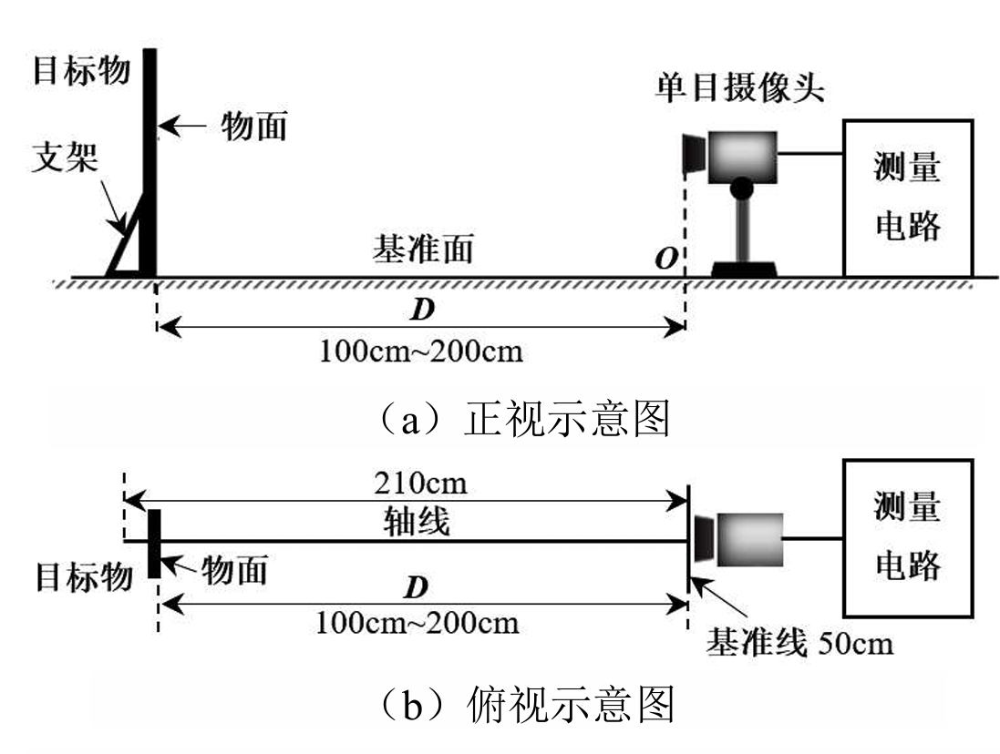

## 2025电赛C题



> 装置以上图为示例（此处仅做视觉思路讨论）


### 一、设计思路&方案

#### 1、相似三角形

​	**本方案主要基于相似三角形原理与计算机视觉几何算法。** 首先，设定 A4 纸为标准物理参照锚点，经摄像头标定获取焦距参数后，通过提取参照物轮廓及计算像素宽度，利用相似三角形公式（D = F  * W / P）解算摄像头与目标平面的垂直距离 ；其次，引入透视变换（Perspective Transform）算法校正非垂直拍摄产生的几何畸变，将图像重映射为标准正视图，确立“像素-物理尺寸”的线性对应关系 ；最后，在矫正平面内运用多边形逼近与圆形度分析算法，实现对正方形、三角形及圆形的精准分类与物理尺寸换算 。

#### 2、相机标定

​	**本方案基于针孔成像模型与多坐标系变换理论，旨在建立二维像素平面与三维物理世界之间的严格数学映射 。**其核心设计思路主要包含三个步骤：首先是**参数解算与标定**，系统需预先拍摄多张不同角度的棋盘格标定板图像，通过算法解算摄像头的内参矩阵（包含焦距 f_x, f_y及主点坐标）与畸变系数（径向与切向畸变），同时确定摄像头相对于测量平面的外参矩阵（旋转向量R与平移向量T）。其次是**逆向投影与坐标重构**，在测量阶段利用畸变系数对原始图像进行去畸变处理，消除广角镜头产生的桶形或枕形形变，随后基于投影矩阵的逆变换，将目标特征点的像素坐标 $(u, v)$ 反向映射回世界坐标系 (X_w, Y_w, Z_w) 。最后是**物理量化计算**，在重构的世界坐标系中计算特征点间的欧氏距离，直接输出目标的实际物理尺寸与空间距离，从而实现精密测量 。然而，其缺陷在于对**系统刚性**要求极高：外参矩阵高度依赖摄像头与地面的固定相对位姿，一旦摄像头发生微小位移或振动，或环境温度导致镜头光路变化，均需重新繁琐标定。这使得该方案在动态或非实验室环境下显得不够灵活，难以满足快速部署的需求 。

*因此*，在现实条件下，我们最终采用的是*相似三角形原理* 的思路


### 二、代码设计

```python
# sum.py

import cv2
import numpy as np
import enum
import math
import juzhenkey
import serial.tools.list_ports
import RPi.GPIO as GPIO
from ina226 import INA226

class ContourType(enum.Enum):
    Nothing = 1,
    Basic_shapes = 2,  # 合并正方形和三角形检测
    Basic_circle = 3,
    Extension_Two_and_One = 5,
    Extension_Rotate = 6,
    Distance_Measure = 7  # 单独测距离模式
    Nested_Rectangle = 8


### A4边框识别和测距
def calculate_pixel_width(contour):
    """使用最小外接接矩形计算短边"""
    rect = cv2.minAreaRect(contour)
    width, height = rect[1]
    distance = min(width, height)
    return distance  # 返回短边长度


def detect_a4_contour(image):
    """检测A4纸轮廓，返回轮廓、阈值图像和A4纸像素面积"""
    gray = cv2.cvtColor(image, cv2.COLOR_BGR2GRAY)
    # 自适应阈值处理 - 增强黑色边框
    thresh = cv2.adaptiveThreshold(
        gray, 255,
        cv2.ADAPTIVE_THRESH_GAUSSIAN_C,
        cv2.THRESH_BINARY_INV, 77, 10
    )
    thresh_copy = thresh.copy()
    kernel = np.ones((3, 3), np.uint8)
    mask = cv2.morphologyEx(thresh, cv2.MORPH_OPEN, kernel)

    contours, _ = cv2.findContours(mask, cv2.RETR_EXTERNAL, cv2.CHAIN_APPROX_SIMPLE)
    if DEBUG_MODE:
        print(f"检测到 {len(contours)} 个轮廓")
    # 筛选A4纸轮廓（最大轮廓+四边形判断）
    if contours:
        contours = sorted(contours, key=cv2.contourArea, reverse=True)
        if DEBUG_MODE:
            print(f"检测到contours  {len(contours)} 个轮廓")
        for cnt in contours:
            area = cv2.contourArea(cnt)
            if DEBUG_MODE:
                print(f"检测到 A4 轮廓 {area:.2f} 面积")
            if area < MIN_CONTOUR_AREA:
                continue

            # 多边形逼近
            peri = cv2.arcLength(cnt, True)
            approx = cv2.approxPolyDP(cnt, 0.02 * peri, True)
            if DEBUG_MODE:
                print(f"len(approx){len(approx)}")
            # 四边形检测
            if len(approx) == 4:
                if DEBUG_MODE:
                    print(f"approx{approx}")
                return approx, thresh_copy, area  # 返回A4纸像素面积
    return None, thresh_copy, 0


def calculate_distance(focal_length, pixel_width):
    """计算目标物距离D"""
    return (focal_length * A4_REAL_WIDTH) / pixel_width


### 透视变换
def perspective_transform(image, contour):
    """将A4纸区域透视变换为标准矩形"""
    # 将轮廓点排序为（左上、右上、右下、左下）
    pts = contour.reshape(4, 2)
    rect = np.zeros((4, 2), dtype="float32")

    # 计算轮廓点中心
    center = np.mean(pts, axis=0)

    # 根据点与中心的相对位置排序
    for point in pts:
        if point[0] < center[0] and point[1] < center[1]:
            rect[0] = point  # 左上
        elif point[0] > center[0] and point[1] < center[1]:
            rect[1] = point  # 右上
        elif point[0] > center[0] and point[1] > center[1]:
            rect[2] = point  # 右下
        else:
            rect[3] = point  # 左下

    # 计算目标标矩形尺寸（保持A4比例）
    width = max(
        np.linalg.norm(rect[0] - rect[1]),
        np.linalg.norm(rect[2] - rect[3])
    )
    height = max(
        np.linalg.norm(rect[0] - rect[3]),
        np.linalg.norm(rect[1] - rect[2])
    )

    # 创建目标点
    dst = np.array([
        [0, 0],
        [width - 1, 0],
        [width - 1, height - 1],
        [0, height - 1]
    ], dtype="float32")

    # 计算变换矩阵
    M = cv2.getPerspectiveTransform(rect, dst)

    # 应用透视变换
    warped = cv2.warpPerspective(image, M, (int(width), int(height)))

    return warped


def calculate_rotation(contour):
    """计算形状的旋转角度（内部使用，不对外输出）"""
    rect = cv2.minAreaRect(contour)
    angle = rect[2]

    # 优化角度计算，确保范围在0-90度之间
    if angle < -45:
        angle += 90
    angle = abs(angle)
    if angle > 90:
        angle = 180 - angle

    return angle


### 形状检测函数
def detect_squares_in_a4(warped, a4_pixel_area):
    """检测正方形，使用面积比例例计算边长"""
    inverted_gray = cv2.bitwise_not(warped)
    _, binary_img = cv2.threshold(inverted_gray, 160, 255, cv2.THRESH_BINARY)
    contours, _ = cv2.findContours(binary_img, cv2.RETR_LIST, cv2.CHAIN_APPROX_NONE)
    squares = []
    for cnt in contours:
        peri = cv2.arcLength(cnt, True)
        approx = cv2.approxPolyDP(cnt, 0.02 * peri, True)
        if len(approx) == 4 and is_square(approx):
            # 计算正方形像素面积（白色部分）
            square_pixel_area = cv2.contourArea(approx)
            if square_pixel_area < 2:
                continue

            # 核心：通过面积比例计算真实面积
            if a4_pixel_area > 0:
                area_ratio = square_pixel_area / a4_pixel_area
                square_real_area = A4_REAL_AREA * area_ratio
                square_real_side = math.sqrt(square_real_area)
            else:
                # 回退方案：原有比例方法
                square_real_side = calculate_square_size_using_a4_ratio(
                    calculate_side_length(approx), warped)

            M = cv2.moments(cnt)
            cX = int(M["m10"] / M["m00"])
            cY = int(M["m01"] / M["m00"])
            squares.append({
                "type": "square",
                "size": square_real_side,
                "center": (cX, cY),
                "contour": approx  # 添加轮廓信息
            })

    return squares


def is_square(contour, angle_threshold=15, aspect_threshold=0.15):
    """验证是否为正方形（基于角度和边长比例）"""
    sides = []
    for i in range(4):
        pt1 = contour[i][0]
        pt2 = contour[(i + 1) % 4][0]
        sides.append(np.linalg.norm(pt2 - pt1))
    max_side, min_side = max(sides), min(sides)
    aspect_ratio = abs(max_side - min_side) / ((max_side + min_side) / 2)
    if aspect_ratio > aspect_threshold:
        return False
    for i in range(4):
        pt1 = contour[i][0]
        pt2 = contour[(i + 1) % 4][0]
        pt3 = contour[(i + 2) % 4][0]
        angle = calculate_angle(pt1, pt2, pt3)
        if not (85 <= angle <= 95):
            return False
    return True


def calculate_angle(p1, p2, p3):
    """计算三点形成的角度"""
    v1 = p1 - p2
    v2 = p3 - p2
    cos_theta = np.dot(v1, v2) / (np.linalg.norm(v1) * np.linalg.norm(v2))
    # 处理数值精度问题
    cos_theta = np.clip(cos_theta, -1.0, 1.0)
    return np.degrees(np.arccos(cos_theta))


def calculate_side_length(contour):
    """计算正方形边长（像素素单位）"""
    sides = []
    for i in range(4):
        pt1 = contour[i][0]
        pt2 = contour[(i + 1) % 4][0]
        sides.append(np.linalg.norm(pt2 - pt1))
    avg_side = np.mean(sides)
    rect = cv2.minAreaRect(contour)
    min_side = min(rect[1])
    return (avg_side + min_side) / 2


def calculate_square_size_using_a4_ratio(pixel_side, warped_a4):
    """基于A4纸比例计算正方形实际尺寸的方法（作为备选）"""
    a4_pixel_height, a4_pixel_width = warped_a4.shape[:2]
    a4_pixel_ratio = a4_pixel_width / a4_pixel_height
    a4_real_ratio = A4_REAL_WIDTH / A4_REAL_HEIGHT  # 标准A4比例

    if a4_pixel_ratio > a4_real_ratio:  # 横放A4纸
        pixel_to_cm = A4_REAL_HEIGHT / a4_pixel_height  # 使用高度计算比例
    else:  # 竖放A4纸
        pixel_to_cm = A4_REAL_WIDTH / a4_pixel_width  # 使用宽度计算比例

    return pixel_side * pixel_to_cm


def detect_triangles_in_a4(warped):
    """检测三角形"""
    inverted = cv2.bitwise_not(warped)
    _, binary_img = cv2.threshold(inverted, 160, 255, cv2.THRESH_BINARY)
    contours, _ = cv2.findContours(binary_img, cv2.RETR_LIST, cv2.CHAIN_APPROX_SIMPLE)
    triangles = []
    for cnt in contours:
        peri = cv2.arcLength(cnt, True)
        approx = cv2.approxPolyDP(cnt, 0.04 * peri, True)
        if len(approx) == 3 and is_equilateral_triangle(approx):
            side_length = calculate_triangle_side(approx)
            pixel_side = side_length
            cm_side = (pixel_side / warped.shape[1]) * A4_REAL_WIDTH

            M = cv2.moments(cnt)
            cX = int(M["m10"] / M["m00"])
            cY = int(M["m01"] / M["m00"])

            triangles.append({
                "type": "triangle",
                "size": cm_side,
                "center": (cX, cY),
                "contour": approx  # 添加轮廓信息

            })
    return triangles


def is_equilateral_triangle(contour, angle_threshold=15, side_threshold=0.15):
    """验证等边三角形（基于角度和边长）"""
    points = contour.reshape(3, 2)
    sides = [
        np.linalg.norm(points[1] - points[0]),
        np.linalg.norm(points[2] - points[1]),
        np.linalg.norm(points[0] - points[2])
    ]
    max_side, min_side = max(sides), min(sides)
    aspect_ratio = abs(max_side - min_side) / ((max_side + min_side) / 2)
    if aspect_ratio > side_threshold:
        return False
    for i in range(3):
        a, b, c = points[i], points[(i + 1) % 3], points[(i + 2) % 3]
        angle = calculate_angle(a, b, c)
        if not (55 <= angle <= 65):
            return False
    return True


def calculate_triangle_side(contour):
    """计算三角形边长（三种方法融合）"""
    points = contour.reshape(3, 2)
    sides_direct = [
        np.linalg.norm(points[1] - points[0]),
        np.linalg.norm(points[2] - points[1]),
        np.linalg.norm(points[0] - points[2])
    ]
    avg_side = np.mean(sides_direct)
    (cx, cy), radius = cv2.minEnclosingCircle(contour)
    circum_radius = radius
    theoretical_side = circum_radius * np.sqrt(3)
    area = cv2.contourArea(contour)
    area_side = (4 * area / np.sqrt(3)) ** 0.5
    return (avg_side * 0.6 + theoretical_side * 0.3 + area_side * 0.1)


def detect_circle_in_a4(warped):
    """检测圆形"""
    inverted_gray = cv2.bitwise_not(warped)
    _, binary_img = cv2.threshold(inverted_gray, 160, 255, cv2.THRESH_BINARY)
    contours, _ = cv2.findContours(binary_img, cv2.RETR_LIST, cv2.CHAIN_APPROX_SIMPLE)
    MIN_AREA = 30
    MAX_AREA = 6000
    MIN_CIRCULARITY = 0.7
    MAX_CIRCULARITY = 1.3

    for contour in contours:
        area = cv2.contourArea(contour)
        perimeter = cv2.arcLength(contour, True)
        if perimeter == 0:
            continue
        circularity = (4 * np.pi * area) / (perimeter ** 2)
        if (MIN_AREA <= area <= MAX_AREA and
                MIN_CIRCULARITY <= circularity <= MAX_CIRCULARITY):
            (x, y), radius = cv2.minEnclosingCircle(contour)
            center = (int(x), int(y))
            diameter = 2 * radius
            pixel_diameter = diameter * circularity
            actual_diameter = (pixel_diameter / warped.shape[1]) * A4_REAL_WIDTH
            if actual_diameter < 9:
                continue
            return {
                "type": "circle",
                "size": actual_diameter,
                "center": (int(x), int(y))
            }
    return None


def detect_and_measure_squares(warped_a4, a4_pixel_area):
    """检测測并测量A4纸上的正方形，使用面积比例例计算边长"""
    # 确保输入转为灰度图
    if len(warped_a4.shape) == 3:
        gray = cv2.cvtColor(warped_a4, cv2.COLOR_BGR2GRAY)
    else:
        gray = warped_a4.copy()

    inverted_gray = cv2.bitwise_not(gray)
    # 阈值处理
    _, binary_img = cv2.threshold(inverted_gray, 150, 255, cv2.THRESH_BINARY)

    # 形态学操作
    kernel = np.ones((2, 2), np.uint8)
    closed1 = cv2.morphologyEx(binary_img, cv2.MORPH_CLOSE, kernel, iterations=1)
    opened = cv2.morphologyEx(closed1, cv2.MORPH_OPEN, kernel, iterations=1)

    # 寻找轮廓
    contours, _ = cv2.findContours(opened, cv2.RETR_LIST, cv2.CHAIN_APPROX_SIMPLE)
    squares = []

    for cnt in contours:
        # 过滤过小轮廓
        area = cv2.contourArea(cnt)
        if area < 5:
            continue

        # 轮廓近似
        peri = cv2.arcLength(cnt, True)
        approx = cv2.approxPolyDP(cnt, 0.03 * peri, True)

        # 检查是否为四边形
        if len(approx) == 4:
            # 计算四条边长度
            sides = []
            for i in range(4):
                x1, y1 = approx[i][0]
                x2, y2 = approx[(i + 1) % 4][0]
                length = np.sqrt((x2 - x1) ** 2 + (y2 - y1) ** 2)
                sides.append(length)

            # 检查边长比例（正方形判断）
            max_side = max(sides)
            min_side = min(sides)
            if max_side == 0:
                continue
            aspect_ratio = min_side / max_side
            if aspect_ratio < (1 - 0.25):  # 放宽的比例阈值
                continue

            # 检查角度是否接近直角
            angles = []
            for i in range(4):
                p_curr = approx[i][0]
                p_prev = approx[(i - 1) % 4][0]
                p_next = approx[(i + 1) % 4][0]

                v_prev = p_curr - p_prev
                v_next = p_curr - p_next

                dot = np.dot(v_prev, v_next)
                norm_prev = np.linalg.norm(v_prev)
                norm_next = np.linalg.norm(v_next)

                if norm_prev > 0 and norm_next > 0:
                    cos_theta = dot / (norm_prev * norm_next)
                    angle = np.abs(np.degrees(np.arccos(np.clip(cos_theta, -1.0, 1.0))))
                    angles.append(angle)

            # 角度检查
            if not angles or not all(70 < a < 110 for a in angles):
                continue

            # 计算平均边长
            side_length = np.mean(sides)

            # 面积一致性检查
            contour_area = cv2.contourArea(approx)
            expected_area = side_length ** 2
            if not (0.5 < (contour_area / expected_area) < 1.5):
                continue

            # 计算中心坐标
            M = cv2.moments(cnt)
            if M["m00"] == 0:
                continue
            cX = int(M["m10"] / M["m00"])
            cY = int(M["m01"] / M["m00"])

            # 计算实际尺寸（使用面积比例法）
            actual_size = None
            if a4_pixel_area > 0:
                area_ratio = contour_area / a4_pixel_area
                square_real_area = A4_REAL_AREA * area_ratio
                actual_size = math.sqrt(square_real_area)
            else:
                actual_size = calculate_square_size_using_a4_ratio(side_length, warped_a4)

            # 添加到结果列表
            squares.append({
                "type": "square",
                "side_length": side_length,
                "center": (cX, cY),
                "actual_size": actual_size,
                "area": contour_area,
                "contour": approx  # 添加轮廓信息
            })

    # 按面积排序
    squares.sort(key=lambda x: x["area"])
    return squares


def find_min_area_square(squares):
    """识别最小面积的正方形"""
    if not squares:
        return None
    return min(squares, key=lambda x: x["side_length"])


def convert_to_cm(pixel_length, warped_image):
    """将像素长度转换为实际厘米"""
    a4_pixel_width = warped_image.shape[1]
    pixel_to_cm_ratio = A4_REAL_WIDTH / a4_pixel_width
    return pixel_length * pixel_to_cm_ratio

# ===== FENGE功能: 内切圆辅助函数开始 =====
def find_local_maxima(dist, min_radius=5):
    """查找距离变换图中的局部最大值点"""
    dilated = cv2.dilate(dist, np.ones((3, 3), np.uint8))
    local_max = (dist == dilated)
    radius_mask = dist > min_radius
    maxima = np.where(local_max & radius_mask)
    points = list(zip(maxima[1], maxima[0]))  # (x, y)
    radii = dist[maxima]
    return points, radii

def compute_intersection(line1, line2):
    """计算两条直线的交点"""
    x1, y1, x2, y2 = line1
    x3, y3, x4, y4 = line2
    denom = (x1 - x2) * (y3 - y4) - (y1 - y2) * (x3 - x4)
    if abs(denom) < 1e-6:  # 避免除零错误
        return None
    px = ((x1 * y2 - y1 * x2) * (x3 - x4) - (x1 - x2) * (x3 * y4 - y3 * x4)) / denom
    py = ((x1 * y2 - y1 * x2) * (y3 - y4) - (y1 - y2) * (x3 * y4 - y3 * x4)) / denom
    # 检查交点是否在合理范围内
    if abs(px) > 10000 or abs(py) > 10000:
        return None
    return int(px), int(py)

def get_lines_and_intersections(edges, min_line_length=30, max_line_gap=10):
    """获取直线和交点"""
    lines = cv2.HoughLinesP(edges, 1, np.pi / 180, threshold=80,
                            minLineLength=min_line_length, maxLineGap=max_line_gap)
    intersections = []
    if lines is not None and len(lines) > 1:
        for i in range(min(len(lines), 20)):  # 限制线条数量避免过多计算
            for j in range(i + 1, min(len(lines), 20)):
                pt = compute_intersection(lines[i][0], lines[j][0])
                if pt is not None:
                    intersections.append(pt)
    return lines, intersections

def get_valid_min_inscribed_circle(img, min_area=500, min_radius=5, ratio_thresh=0.5,
                                   intersections=None, px_per_cm=100):
    """获取有效的最小内切圆"""
    _, binary = cv2.threshold(img, 0, 255, cv2.THRESH_BINARY_INV + cv2.THRESH_OTSU)
    num_labels, labels = cv2.connectedComponents(binary)
    circles = []
    diameters = []

    if intersections is None:
        intersections = []

    for label in range(1, num_labels):
        mask = np.uint8(labels == label) * 255
        area = cv2.countNonZero(mask)
        if area < min_area:
            continue
        dist_transform = cv2.distanceTransform(mask, cv2.DIST_L2, 5)
        centers, radii = find_local_maxima(dist_transform, min_radius)
        for center, radius in zip(centers, radii):
            cx, cy = center
            # 检查是否有有效的交点，并且避免空列表或无效值
            too_close = False
            if intersections:
                try:
                    too_close = any(np.hypot(cx - ix, cy - iy) < radius * 1.2
                                    for ix, iy in intersections
                                    if ix is not None and iy is not None)
                except:
                    too_close = False
            if too_close:
                continue
            diameter = radius * 2
            diameter_cm = diameter / px_per_cm
            if diameter_cm >= 5.5:  # 只保留有效圆
                circles.append((center, int(radius)))
                diameters.append((diameter, center, int(radius)))

    valid_min_circle = None
    valid_min_diameter = None
    if diameters:
        max_diameter_tuple = max(diameters, key=lambda x: x[0])
        max_diameter = max_diameter_tuple[0]
        valid_circles = [d for d in diameters if d[0] > ratio_thresh * max_diameter]
        if valid_circles:
            valid_min_circle_tuple = min(valid_circles, key=lambda x: x[0])
            valid_min_diameter, valid_min_center, valid_min_radius = valid_min_circle_tuple
            valid_min_circle = (valid_min_center, valid_min_radius)
    else:
        max_diameter_tuple = None
        max_diameter = None

    return circles, max_diameter_tuple if diameters else None, valid_min_circle, valid_min_diameter, max_diameter if diameters else None
# ===== FENGE功能: 内切圆辅助函数结束 =====

# ===== FENGE功能: 嵌套矩形检测函数开始 =====
def find_nested_rectangles_fenge(contours, area_thresh=500):
    """FENGE功能：查找嵌套矩形"""
    rects = []
    for cnt in contours:
        epsilon = 0.02 * cv2.arcLength(cnt, True)
        approx = cv2.approxPolyDP(cnt, epsilon, True)
        if len(approx) == 4 and cv2.isContourConvex(approx):
            area = cv2.contourArea(approx)
            if area > area_thresh:
                rects.append((area, approx))
    rects = sorted(rects, key=lambda x: -x[0])
    for i in range(len(rects)):
        outer = rects[i][1]
        for j in range(i + 1, len(rects)):
            inner = rects[j][1]
            if all(cv2.pointPolygonTest(outer, (float(p[0][0]), float(p[0][1])), False) >= 0 for p in inner):
                return outer, inner
    return None, None
# ===== FENGE功能: 嵌套矩形检测函数结束 =====

# ===== FENGE功能: 主处理函数开始 =====
def process_nested_rectangle_detection(frame):
    """处理嵌套矩形和内切圆检测"""
    gray = cv2.cvtColor(frame, cv2.COLOR_BGR2GRAY)
    _, binary = cv2.threshold(gray, 120, 255, cv2.THRESH_BINARY_INV)
    contours, _ = cv2.findContours(binary, cv2.RETR_TREE, cv2.CHAIN_APPROX_SIMPLE)
    outer_box, inner_box = find_nested_rectangles_fenge(contours)
    
    result_text = "Nested Rect: Not found"
    
    if outer_box is not None and inner_box is not None:
        cv2.drawContours(frame, [outer_box], -1, (0, 255, 0), 2)
        cv2.drawContours(frame, [inner_box], -1, (255, 0, 0), 2)
        
        x, y, w, h = cv2.boundingRect(outer_box)
        distance_w = (FENGE_FOCAL_LENGTH * FENGE_KNOWN_WIDTH_CM) / w
        distance_h = (FENGE_FOCAL_LENGTH * FENGE_KNOWN_HEIGHT_CM) / h
        distance = (distance_w + distance_h) / 2
        
        cv2.putText(frame, f"Distance: {distance:.2f} cm", (x, y - 10),
                    cv2.FONT_HERSHEY_SIMPLEX, 0.6, (0, 0, 255), 2)
        
        x2, y2, w2, h2 = cv2.boundingRect(inner_box)
        border_px = ((x2 - x) + ((x + w) - (x2 + w2)) + (y2 - y) + ((y + h) - (y2 + h2))) / 4
        px_per_cm = border_px / FENGE_REAL_BORDER_WIDTH_CM if border_px > 0 else 100
        
        roi = gray[y:y + h, x:x + w]
        edge_roi = cv2.Canny(roi, 50, 150)
        lines, intersections = get_lines_and_intersections(edge_roi)
        
        circles, max_tuple, min_circle, min_diameter, max_diameter = get_valid_min_inscribed_circle(
            roi, min_area=500, min_radius=5, ratio_thresh=0.5, intersections=intersections, px_per_cm=px_per_cm)
        
        if max_tuple:
            _, max_center, max_radius = max_tuple
            cv2.circle(frame, (max_center[0] + x, max_center[1] + y), max_radius, (255, 0, 0), 2)
        
        if min_circle and min_diameter and max_diameter:
            min_center, min_radius = min_circle
            
            # 简化版本，不使用畸变校正
            min_diameter_cm = min_diameter / px_per_cm
            max_diameter_cm = max_diameter / px_per_cm
            ratio = min_diameter_cm / max_diameter_cm  -0.2

            # ===== 计算最小矩形边长 =====
            # 获取内部矩形框的边长
            inner_width = w2  # 内部矩形的宽度（像素）
            inner_height = h2  # 内部矩形的高度（像素）
            
            # 转换为厘米
            inner_width_cm = inner_width / px_per_cm
            inner_height_cm = inner_height / px_per_cm
            
            # 最小边长
            min_rect_side = min(inner_width_cm, inner_height_cm)
            
            # 打印结果
            print(f"检测到最小矩形边长: {min_diameter_cm:.1f} cm")
            
            
            # 绘制结果
            
            cv2.circle(frame, (min_center[0] + x, min_center[1] + y), min_radius, (0, 0, 255), 2)
            result_text = f"Rect: {min_rect_side:.1f}cm | Circles: {min_diameter_cm:.1f}/{max_diameter_cm:.1f}cm R={ratio:.2f}"
        
        if lines is not None:
            for line in lines:
                x1, y1, x2, y2 = line[0]
                cv2.line(frame, (x1 + x, y1 + y), (x2 + x, y2 + y), (200, 200, 0), 1)
        
        for pt in intersections:
            cv2.circle(frame, (pt[0] + x, pt[1] + y), 3, (255, 255, 0), -1)
    
    return result_text
# ===== FENGE功能: 主处理函数结束 =====


if __name__ == "__main__":
    ### 主循环
    '''
    print("程序启动 - 按以下键选择检测模式:")
    print("1: 基本形状检测（正方形和三角形）")
    print("2: 圆形检测")
    print("3: 检测多个正方形(最小)")
    print("4: 检测旋转信息")
    print("5: 单独测距离")
    print("ESC: 退出程序")
    '''
    sensor = INA226()
    
    contour_type = ContourType.Nothing
    
    DEBUG_MODE = False  # 调试模式显示中间过程

    A4_REAL_WIDTH = 21.0  # A4纸实际宽度(cm)
    A4_REAL_HEIGHT = 29.7  # A4纸实际高度(cm)
    A4_REAL_AREA = A4_REAL_WIDTH * A4_REAL_HEIGHT  # A4纸实际面积(cm²)
    MIN_CONTOUR_AREA = 1200  # 最小轮廓面积阈值（过滤噪声）
    FOCAL_LENGTH = 678.57  # 摄像头焦距（使用默认值）
    # ===== FENGE功能: 常量定义开始 =====
    FENGE_KNOWN_WIDTH_CM = 21.0    # A4纸宽度
    FENGE_KNOWN_HEIGHT_CM = 29.7   # A4纸高度
    FENGE_FOCAL_LENGTH = 678.57       # fenge使用的焦距
    FENGE_REAL_BORDER_WIDTH_CM = 2.0  # 实际黑边宽度
    # ===== FENGE功能: 常量定义结束 =====
    max_current_p = 0
    # 创建视频捕获对象
    cap = cv2.VideoCapture(0, cv2.CAP_V4L2)
    cap.set(cv2.CAP_PROP_FRAME_WIDTH, 320)
    cap.set(cv2.CAP_PROP_FRAME_HEIGHT, 240)
    
    gpio = juzhenkey.ReadGpio()
    # serial_port = serial.Serial(port="/dev/ttyUSB1", baudrate=115200,timeout=0.2)
    print('矩阵键盘初始化成功')
    while True:
        # 读取图像
        ret, img_cv2 = cap.read()
        if not ret:
            print("无法获取摄像头图像")
            break

        # 显示操作提示
        cv2.putText(img_cv2, "1:Shapes 2:Circle 3:MultiSq 4:Rotate 5:Distance", (10, 20),
                    cv2.FONT_HERSHEY_SIMPLEX, 0.5, (0, 255, 0), 1)
        
        current_a = abs(sensor.current_a())
        current_p = current_a * 5
        if current_p > max_current_p:
            max_current_p = current_p
        print(f'Current_a = {current_a:3f}A')
        print(f'Current_p = {current_p:3f}A')
        print(f'max_Current_p = {max_current_p:3f}A')

        # 检测键盘输入
        key = gpio.read_key()
        if key:
            print(f'检测到按键:{key}')
        if key == 27:  # ESC键退出
            break
        elif  key == '1' or key == '2' or key == '3' or key == '4' or key == '5' or key == '6' or key == '7' or key == '8' or key == '9' or key =='10':
            contour_type = ContourType.Distance_Measure
            print("切换到单独测距离模式")
        elif key == '11':
            contour_type = ContourType.Basic_shapes
            print("切换到基本形状检测模式（正方形和三角形）")
        elif key == '12':
            contour_type = ContourType.Basic_circle
            print("切换到圆形检测模式")
        elif key == '13':
            contour_type = ContourType.Extension_Two_and_One
            print("切换到多正方形检测模式")
        elif key == '14':
            contour_type = ContourType.Extension_Rotate
            print("切换到旋转检测模式")
        elif key == '15':
            contour_type = ContourType.Nested_Rectangle
            print("切换到重叠矩形检测模式")

        # 处理图像
        text = "Nothing"

        if contour_type != ContourType.Nothing:
            # 检测A4纸轮廓，获取A4纸像素面积
            contour, thresh, a4_pixel_area = detect_a4_contour(img_cv2)
            if contour is not None:
                # 计算像素宽度和距离
                pixel_width = calculate_pixel_width(contour)
                distance = calculate_distance(FOCAL_LENGTH, pixel_width)

                # 根据模式执行不同操作
                if contour_type == ContourType.Distance_Measure:
                    # 单独测距离模式：只显示距离信息
                    print(f"A4纸距离: {distance:.2f} cm")
                    text = f"Distance: {distance:.2f} cm"
                    # 绘制A4纸轮廓（可视化）
                    cv2.drawContours(img_cv2, [contour], -1, (0, 255, 0), 2)
                else:
                    # 透视变换
                    warped = perspective_transform(thresh, contour)
                    warped_copy = warped.copy()

                    if contour_type == ContourType.Basic_shapes:
                        # 同时检测正方形和三角形
                        squares = detect_squares_in_a4(warped_copy, a4_pixel_area)
                        triangles = detect_triangles_in_a4(warped_copy)

                        # 合并结果
                        all_shapes = squares + triangles

                        if all_shapes:
                            # 显示所有检测到的形状
                            shape_info = []
                            for shape in all_shapes:
                                shape_info.append(f"{shape['type']}:{shape['size']:.2f}cm")
                                # 在图像上标记形状中心
                                cv2.circle(img_cv2, shape['center'], 5, (0, 255, 0), -1)

                            print(f"检测到形状: {', '.join(shape_info)}, 距离: {distance:.2f} cm")
                            text = f"Shapes,D:{distance:.2f},{', '.join(shape_info)}"

                    elif contour_type == ContourType.Basic_circle:
                        circle = detect_circle_in_a4(warped_copy)
                        if circle:
                            print(f"圆形直径: {circle['size']:.2f} cm, 距离: {distance:.2f} cm")
                            text = f"Circle,D:{distance:.2f},size:{circle['size']:.2f}"
                            # 标记圆心
                            cv2.circle(img_cv2, circle['center'], 5, (0, 0, 255), -1)

                    elif contour_type == ContourType.Extension_Two_and_One:
                        squares = detect_and_measure_squares(warped, a4_pixel_area)
                        if squares and len(squares) > 0:
                            min_square = find_min_area_square(squares)
                            if min_square:
                                actual_size = min_square["actual_size"]
                                print(f"最小正方形边长: {actual_size:.2f} cm, 距离: {distance:.2f} cm")
                                text = f"MinSquare,D:{distance:.2f},size:{actual_size:.2f}"

                    elif contour_type == ContourType.Extension_Rotate:
                        squares = detect_and_measure_squares(warped, a4_pixel_area)
                        if squares and len(squares) > 0:
                            min_square = find_min_area_square(squares)
                            if min_square:
                                actual_size = min_square["actual_size"]
                                print(f"最小正方形边长: {actual_size:.2f} cm")
                                text = f"ROTATE,size:{actual_size:.2f} cm"
                    # ===== FENGE功能: 特殊处理开始 =====
                    elif contour_type == ContourType.Nested_Rectangle:
                        # 嵌套矩形检测不需要A4纸检测，直接处理
                        text = process_nested_rectangle_detection(img_cv2)
                        # 显示结果
                        cv2.putText(img_cv2, text, (10, 40), cv2.FONT_HERSHEY_SIMPLEX, 0.5, (0, 0, 255), 1)
                        cv2.imshow("Shape Detection", img_cv2)
                        
                        continue  # 跳过后续A4纸检测流程
                    # ===== FENGE功能: 特殊处理结束 =====

        # 显示结果
        cv2.putText(img_cv2, text, (10, 40), cv2.FONT_HERSHEY_SIMPLEX, 0.5, (0, 0, 255), 1)
        cv2.imshow("Shape Detection", img_cv2)

    # 释放资源
    cap.release()
    cv2.destroyAllWindows()

```

```python
# 嵌套矩形和内切圆检测

import cv2
import numpy as np
import math

# 已知尺寸与焦距
KNOWN_WIDTH_CM = 21.0
KNOWN_HEIGHT_CM = 29.7
FOCAL_LENGTH = 400
REAL_BORDER_WIDTH_CM = 2.0  # 实际黑边宽度


# === 内切圆辅助函数 ===
def find_local_maxima(dist, min_radius=5):
    dilated = cv2.dilate(dist, np.ones((3, 3), np.uint8))
    local_max = (dist == dilated)
    radius_mask = dist > min_radius
    maxima = np.where(local_max & radius_mask)
    points = list(zip(maxima[1], maxima[0]))  # (x, y)
    radii = dist[maxima]
    return points, radii


def compute_intersection(line1, line2):
    x1, y1, x2, y2 = line1
    x3, y3, x4, y4 = line2
    denom = (x1 - x2) * (y3 - y4) - (y1 - y2) * (x3 - x4)
    if abs(denom) < 1e-6:  # 避免除零错误
        return None
    px = ((x1 * y2 - y1 * x2) * (x3 - x4) - (x1 - x2) * (x3 * y4 - y3 * x4)) / denom
    py = ((x1 * y2 - y1 * x2) * (y3 - y4) - (y1 - y2) * (x3 * y4 - y3 * x4)) / denom
    # 检查交点是否在合理范围内
    if abs(px) > 10000 or abs(py) > 10000:
        return None
    return int(px), int(py)


def get_lines_and_intersections(edges, min_line_length=30, max_line_gap=10):
    lines = cv2.HoughLinesP(edges, 1, np.pi / 180, threshold=80,
                            minLineLength=min_line_length, maxLineGap=max_line_gap)
    intersections = []
    if lines is not None and len(lines) > 1:
        for i in range(min(len(lines), 20)):  # 限制线条数量避免过多计算
            for j in range(i + 1, min(len(lines), 20)):
                pt = compute_intersection(lines[i][0], lines[j][0])
                if pt is not None:
                    intersections.append(pt)
    return lines, intersections


def get_valid_min_inscribed_circle(img, min_area=500, min_radius=5, ratio_thresh=0.5,
                                   intersections=None, px_per_cm=100):
    _, binary = cv2.threshold(img, 0, 255, cv2.THRESH_BINARY_INV + cv2.THRESH_OTSU)
    num_labels, labels = cv2.connectedComponents(binary)
    circles = []
    diameters = []

    if intersections is None:
        intersections = []

    for label in range(1, num_labels):
        mask = np.uint8(labels == label) * 255
        area = cv2.countNonZero(mask)
        if area < min_area:
            continue
        dist_transform = cv2.distanceTransform(mask, cv2.DIST_L2, 5)
        centers, radii = find_local_maxima(dist_transform, min_radius)
        for center, radius in zip(centers, radii):
            cx, cy = center
            # 检查是否有有效的交点，并且避免空列表或无效值
            too_close = False
            if intersections:
                try:
                    too_close = any(np.hypot(cx - ix, cy - iy) < radius * 1.2
                                    for ix, iy in intersections
                                    if ix is not None and iy is not None)
                except:
                    too_close = False
            if too_close:
                continue
            diameter = radius * 2
            diameter_cm = diameter / px_per_cm
            if diameter_cm >= 5.5:  # 只保留有效圆
                circles.append((center, int(radius)))
                diameters.append((diameter, center, int(radius)))

    valid_min_circle = None
    valid_min_diameter = None
    if diameters:
        max_diameter_tuple = max(diameters, key=lambda x: x[0])
        max_diameter = max_diameter_tuple[0]
        valid_circles = [d for d in diameters if d[0] > ratio_thresh * max_diameter]
        if valid_circles:
            valid_min_circle_tuple = min(valid_circles, key=lambda x: x[0])
            valid_min_diameter, valid_min_center, valid_min_radius = valid_min_circle_tuple
            valid_min_circle = (valid_min_center, valid_min_radius)
    else:
        max_diameter_tuple = None
        max_diameter = None

    return circles, max_diameter_tuple if diameters else None, valid_min_circle, valid_min_diameter, max_diameter if diameters else None


# === 嵌套矩形检测 ===
def find_nested_rectangles(contours, area_thresh=500):
    rects = []
    for cnt in contours:
        epsilon = 0.02 * cv2.arcLength(cnt, True)
        approx = cv2.approxPolyDP(cnt, epsilon, True)
        if len(approx) == 4 and cv2.isContourConvex(approx):
            area = cv2.contourArea(approx)
            if area > area_thresh:
                rects.append((area, approx))
    rects = sorted(rects, key=lambda x: -x[0])
    for i in range(len(rects)):
        outer = rects[i][1]
        for j in range(i + 1, len(rects)):
            inner = rects[j][1]
            if all(cv2.pointPolygonTest(outer, (float(p[0][0]), float(p[0][1])), False) >= 0 for p in inner):
                return outer, inner
    return None, None


# === 主程序 ===
cap = cv2.VideoCapture(0)

while True:
    ret, frame = cap.read()
    if not ret:
        break

    gray = cv2.cvtColor(frame, cv2.COLOR_BGR2GRAY)
    _, binary = cv2.threshold(gray, 120, 255, cv2.THRESH_BINARY_INV)
    contours, _ = cv2.findContours(binary, cv2.RETR_TREE, cv2.CHAIN_APPROX_SIMPLE)
    outer_box, inner_box = find_nested_rectangles(contours)

    if outer_box is not None and inner_box is not None:
        cv2.drawContours(frame, [outer_box], -1, (0, 255, 0), 2)
        cv2.drawContours(frame, [inner_box], -1, (255, 0, 0), 2)

        x, y, w, h = cv2.boundingRect(outer_box)
        distance_w = (FOCAL_LENGTH * KNOWN_WIDTH_CM) / w
        distance_h = (FOCAL_LENGTH * KNOWN_HEIGHT_CM) / h
        distance = (distance_w + distance_h) / 2

        cv2.putText(frame, f"Distance: {distance:.2f} cm", (x, y - 10),
                    cv2.FONT_HERSHEY_SIMPLEX, 0.6, (0, 0, 255), 2)

        x2, y2, w2, h2 = cv2.boundingRect(inner_box)
        border_px = ((x2 - x) + ((x + w) - (x2 + w2)) + (y2 - y) + ((y + h) - (y2 + h2))) / 4
        px_per_cm = border_px / REAL_BORDER_WIDTH_CM if border_px > 0 else 100

        roi = gray[y:y + h, x:x + w]
        edge_roi = cv2.Canny(roi, 50, 150)
        lines, intersections = get_lines_and_intersections(edge_roi)

        circles, max_tuple, min_circle, min_diameter, max_diameter = get_valid_min_inscribed_circle(
            roi, min_area=500, min_radius=5, ratio_thresh=0.5, intersections=intersections, px_per_cm=px_per_cm)

        if max_tuple:
            _, max_center, max_radius = max_tuple
            cv2.circle(frame, (max_center[0] + x, max_center[1] + y), max_radius, (255, 0, 0), 2)

        if min_circle and min_diameter and max_diameter:
            min_center, min_radius = min_circle

            # 计算矩形框的中心点作为参考点
            rect_center_x = x + w / 2
            rect_center_y = y + h / 2

            # 计算圆心到矩形中心的距离
            min_circle_center_x = min_center[0] + x
            min_circle_center_y = min_center[1] + y

            # 使用相似三角形原理进行畸变校正
            # 基于矩形框已知尺寸计算像素到厘米的转换比例
            px_per_cm_w = w / KNOWN_WIDTH_CM  # 宽度方向的像素/厘米比例
            px_per_cm_h = h / KNOWN_HEIGHT_CM  # 高度方向的像素/厘米比例

            # 根据圆心位置进行加权平均校正
            # 越靠近中心，校正因子越接近1；越远离中心，校正因子越大
            dx = abs(min_circle_center_x - rect_center_x) / (w / 2)  # 水平偏移比例
            dy = abs(min_circle_center_y - rect_center_y) / (h / 2)  # 垂直偏移比例

            # 基于位置的校正因子（简化的畸变模型）
            distortion_factor = 1 + 0.1 * (dx + dy)  # 可根据实际情况调整系数

            # 计算校正后的像素/厘米比例
            effective_px_per_cm = (px_per_cm_w + px_per_cm_h) / 2 * distortion_factor

            # 将像素直径转换为厘米（校正后）
            min_diameter_cm = min_diameter / effective_px_per_cm
            max_diameter_cm = max_diameter / effective_px_per_cm
            ratio = min_diameter_cm / max_diameter_cm

            cv2.circle(frame, (min_circle_center_x, min_circle_center_y), min_radius, (0, 0, 255), 2)
            cv2.putText(frame, f"Min: {min_diameter_cm:.1f}cm Max: {max_diameter_cm:.1f}cm R={ratio:.2f}",
                        (10, 30), cv2.FONT_HERSHEY_SIMPLEX, 0.6, (0, 0, 255), 2)
            cv2.putText(frame, f"Distortion: {distortion_factor:.2f}",
                        (10, 50), cv2.FONT_HERSHEY_SIMPLEX, 0.6, (255, 255, 0), 2)

        if lines is not None:
            for line in lines:
                x1, y1, x2, y2 = line[0]
                cv2.line(frame, (x1 + x, y1 + y), (x2 + x, y2 + y), (200, 200, 0), 1)

        for pt in intersections:
            cv2.circle(frame, (pt[0] + x, pt[1] + y), 3, (255, 255, 0), -1)

    else:
        cv2.putText(frame, "No valid nested rectangles", (20, 40),
                    cv2.FONT_HERSHEY_SIMPLEX, 0.7, (0, 0, 255), 2)

    cv2.imshow("Final Result", frame)
    if cv2.waitKey(1) & 0xFF == 27:
        break

cap.release()
cv2.destroyAllWindows()
```

```python
# 键盘驱动

#!/usr/bin/python
#-*- coding:utf-8 -*-
import RPi.GPIO as GPIO
import time

class ReadGpio:
    def __init__(self):
        # 4x4矩阵键盘引脚设置
        self.ROW_PINS = [5, 6, 13, 19]    # 行引脚
        self.COL_PINS = [12, 16, 20, 21]   # 列引脚
        self.key_map = [
            [1, 2, 3, 4],
            [5, 6, 7, 8],
            [9, 10, 11, 12],
            [13, 14, 15, 16]
        ]
        self.GPIO_init()
    
    def GPIO_init(self):
        GPIO.setmode(GPIO.BCM)
        # 设置行引脚为输出，初始高电平
        for pin in self.ROW_PINS:
            GPIO.setup(pin, GPIO.OUT)
            GPIO.output(pin, GPIO.HIGH)
        # 设置列引脚为输入，上拉
        for pin in self.COL_PINS:
            GPIO.setup(pin, GPIO.IN, pull_up_down=GPIO.PUD_UP)
        print('GPIO listening!')
  
    def read_key(self):
        key_value = None
        time.sleep(0.05)  # 去抖动
        
        # 扫描矩阵键盘
        for row in range(4):
            GPIO.output(self.ROW_PINS[row], GPIO.LOW)
            
            for col in range(4):
                if GPIO.input(self.COL_PINS[col]) == GPIO.LOW:
                    key_value = str(self.key_map[row][col])  # 返回字符串形式的数字
                    print(f"KEY {key_value} PRESS")
                    # 等待按键释放
                    while GPIO.input(self.COL_PINS[col]) == GPIO.LOW:
                        time.sleep(0.01)
            
            GPIO.output(self.ROW_PINS[row], GPIO.HIGH)
            
        return key_value

if __name__ == '__main__':
    gpio = ReadGpio()
    while True:
        gpio.read_key()

```

```python
# 能耗监测驱动

# ina226.py
import smbus

class INA226:
    REG_CONFIG        = 0x00
    REG_SHUNT_VOLTAGE = 0x01
    REG_BUS_VOLTAGE   = 0x02
    REG_POWER         = 0x03
    REG_CURRENT       = 0x04
    REG_CALIBRATION   = 0x05

    def __init__(self, i2c_addr=0x40, shunt=0.010, max_current=3.2, bus=1):
        self.addr = i2c_addr
        self.shunt = shunt
        self.current_lsb = max_current / 32768
        self.cal = int(0.00512 / (self.current_lsb * self.shunt))
        self.i2c = smbus.SMBus(bus)
        self._configure()

    def _write_reg(self, reg, value):
        self.i2c.write_i2c_block_data(self.addr, reg,
                                      [(value >> 8) & 0xFF, value & 0xFF])

    def _read_reg(self, reg):
        data = self.i2c.read_i2c_block_data(self.addr, reg, 2)
        return (data[0] << 8) | data[1]

    def _configure(self):
        # 连续模式，128 次平均，1.1 ms 转换时间
        self._write_reg(self.REG_CONFIG, 0x4127)
        self._write_reg(self.REG_CALIBRATION, self.cal)

    def current_a(self):
        raw = self._read_reg(self.REG_CURRENT)
        if raw > 0x7FFF:
            raw -= 0x10000
        return raw * self.current_lsb
```

